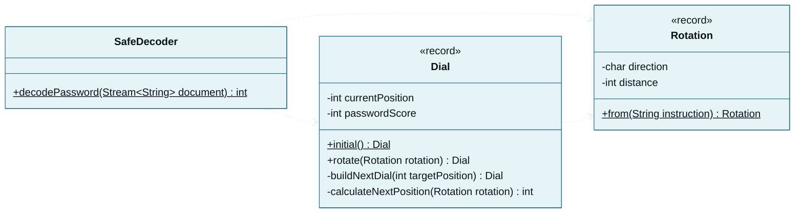
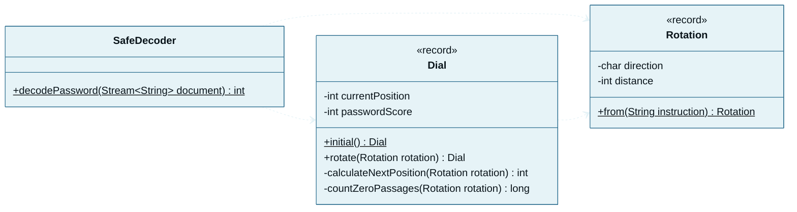

# Diagramas de Clases - Día 1
## Día 1 - Parte A

```mermaid
%%{init: {
  'theme': 'base',
  'themeVariables': {
    'background': '#0A141A',
    'primaryColor': '#E6F3F7',
    'primaryTextColor': '#0A141A',
    'primaryBorderColor': '#2C6E8F',
    'lineColor': '#E6F3F7',
    'secondaryColor': '#E6F3F7',
    'tertiaryColor': '#E6F3F7'
  }
}}%%
classDiagram
    direction LR
    class SafeDecoder {
        +decodePassword(Stream~String~ document) int$
    }
    class Dial {
        <<record>>
        -int currentPosition
        -int passwordScore
        +initial() Dial$
        +rotate(Rotation rotation) Dial
        -buildNextDial(int targetPosition) Dial
        -calculateNextPosition(Rotation rotation) int
    }
    class Rotation {
        <<record>>
        -char direction
        -int distance
        +from(String instruction) Rotation$
    }

    SafeDecoder ..> Rotation
    SafeDecoder ..> Dial
    Dial ..> Rotation
```

---

## Día 1 - Parte B

```mermaid
%%{init: {
  'theme': 'base',
  'themeVariables': {
    'background': '#0A141A',
    'primaryColor': '#E6F3F7',
    'primaryTextColor': '#0A141A',
    'primaryBorderColor': '#2C6E8F',
    'lineColor': '#E6F3F7',
    'secondaryColor': '#E6F3F7',
    'tertiaryColor': '#E6F3F7'
  }
}}%%
classDiagram
    direction LR
    class SafeDecoder {
        +decodePassword(Stream~String~ document) int$
    }
    class Dial {
        <<record>>
        -int currentPosition
        -int passwordScore
        +initial() Dial$
        +rotate(Rotation rotation) Dial
        -calculateNextPosition(Rotation rotation) int
        -countZeroPassages(Rotation rotation) long
    }
    class Rotation {
        <<record>>
        -char direction
        -int distance
        +from(String instruction) Rotation$
    }

    SafeDecoder ..> Rotation
    SafeDecoder ..> Dial
    Dial ..> Rotation
```

