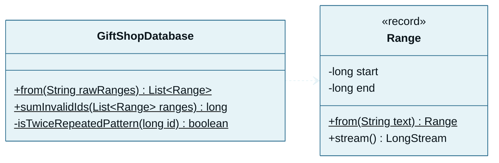
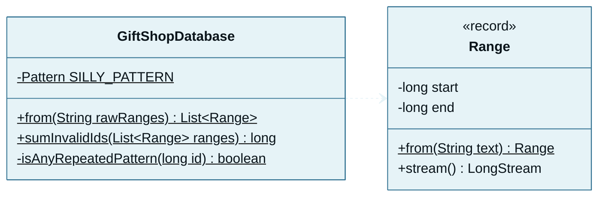

# Diagramas de Clases - Día 2

## Día 2 - Parte A

```mermaid
%%{init: {
  'theme': 'base',
  'themeVariables': {
    'background': '#0A141A',
    'primaryColor': '#E6F3F7',
    'primaryTextColor': '#0A141A',
    'primaryBorderColor': '#2C6E8F',
    'lineColor': '#E6F3F7',
    'secondaryColor': '#E6F3F7',
    'tertiaryColor': '#E6F3F7'
  }
}}%%
classDiagram
    direction LR
    class Range {
        <<record>>
        -long start
        -long end
        +from(String text) Range$
        +stream() LongStream
    }
    class GiftShopDatabase {
        +from(String rawRanges) List~Range~$
        +sumInvalidIds(List~Range~ ranges) long$
        -isTwiceRepeatedPattern(long id) boolean$
    }

    GiftShopDatabase ..> Range
```

---

## Día 2 - Parte B

```mermaid
%%{init: {
  'theme': 'base',
  'themeVariables': {
    'background': '#0A141A',
    'primaryColor': '#E6F3F7',
    'primaryTextColor': '#0A141A',
    'primaryBorderColor': '#2C6E8F',
    'lineColor': '#E6F3F7',
    'secondaryColor': '#E6F3F7',
    'tertiaryColor': '#E6F3F7'
  }
}}%%
classDiagram
    direction LR
    class Range {
        <<record>>
        -long start
        -long end
        +from(String text) Range$
        +stream() LongStream
    }
    class GiftShopDatabase {
        -Pattern SILLY_PATTERN$
        +from(String rawRanges) List~Range~$
        +sumInvalidIds(List~Range~ ranges) long$
        -isAnyRepeatedPattern(long id) boolean$
    }

    GiftShopDatabase ..> Range
```
