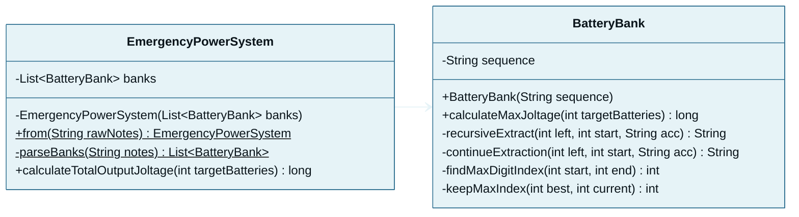

# Diagramas de Clases - Día 3

## Día 3 - Parte A y Parte B

*(Nota: Ambas partes comparten exactamente las mismas clases de negocio, por lo que su estructura y relaciones son idénticas).*

```mermaid
%%{init: {
  'theme': 'base',
  'themeVariables': {
    'background': '#0A141A',
    'primaryColor': '#E6F3F7',
    'primaryTextColor': '#0A141A',
    'primaryBorderColor': '#2C6E8F',
    'lineColor': '#E6F3F7',
    'secondaryColor': '#E6F3F7',
    'tertiaryColor': '#E6F3F7'
  }
}}%%
classDiagram
    direction LR
    class EmergencyPowerSystem {
        -List~BatteryBank~ banks
        -EmergencyPowerSystem(List~BatteryBank~ banks)
        +from(String rawNotes) EmergencyPowerSystem$
        -parseBanks(String notes) List~BatteryBank~$
        +calculateTotalOutputJoltage(int targetBatteries) long
    }
    class BatteryBank {
        -String sequence
        +BatteryBank(String sequence)
        +calculateMaxJoltage(int targetBatteries) long
        -recursiveExtract(int left, int start, String acc) String
        -continueExtraction(int left, int start, String acc) String
        -findMaxDigitIndex(int start, int end) int
        -keepMaxIndex(int best, int current) int
    }

    EmergencyPowerSystem --> BatteryBank
```
