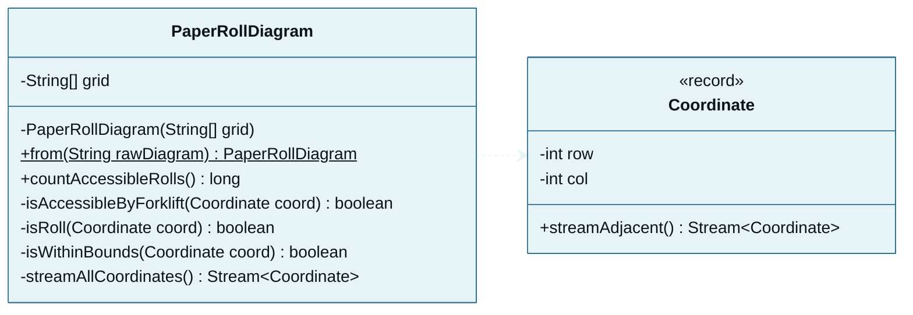
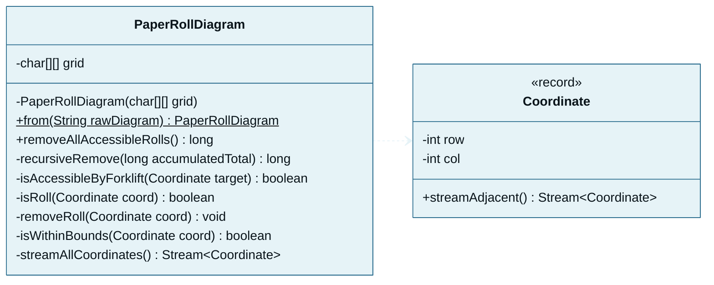

# Diagramas de Clases - Día 4

## Día 4 - Parte A

```mermaid
%%{init: {
  'theme': 'base',
  'themeVariables': {
    'background': '#0A141A',
    'primaryColor': '#E6F3F7',
    'primaryTextColor': '#0A141A',
    'primaryBorderColor': '#2C6E8F',
    'lineColor': '#E6F3F7',
    'secondaryColor': '#E6F3F7',
    'tertiaryColor': '#E6F3F7'
  }
}}%%
classDiagram
    direction LR
    class Coordinate {
        <<record>>
        -int row
        -int col
        +streamAdjacent() Stream~Coordinate~
    }
    class PaperRollDiagram {
        -String[] grid
        -PaperRollDiagram(String[] grid)
        +from(String rawDiagram) PaperRollDiagram$
        +countAccessibleRolls() long
        -isAccessibleByForklift(Coordinate coord) boolean
        -isRoll(Coordinate coord) boolean
        -isWithinBounds(Coordinate coord) boolean
        -streamAllCoordinates() Stream~Coordinate~
    }

    PaperRollDiagram ..> Coordinate
```

---

## Día 4 - Parte B

```mermaid
%%{init: {
  'theme': 'base',
  'themeVariables': {
    'background': '#0A141A',
    'primaryColor': '#E6F3F7',
    'primaryTextColor': '#0A141A',
    'primaryBorderColor': '#2C6E8F',
    'lineColor': '#E6F3F7',
    'secondaryColor': '#E6F3F7',
    'tertiaryColor': '#E6F3F7'
  }
}}%%
classDiagram
    direction LR
    class Coordinate {
        <<record>>
        -int row
        -int col
        +streamAdjacent() Stream~Coordinate~
    }
    class PaperRollDiagram {
        -char[][] grid
        -PaperRollDiagram(char[][] grid)
        +from(String rawDiagram) PaperRollDiagram$
        +removeAllAccessibleRolls() long
        -recursiveRemove(long accumulatedTotal) long
        -isAccessibleByForklift(Coordinate target) boolean
        -isRoll(Coordinate coord) boolean
        -removeRoll(Coordinate coord) void
        -isWithinBounds(Coordinate coord) boolean
        -streamAllCoordinates() Stream~Coordinate~
    }

    PaperRollDiagram ..> Coordinate
```
