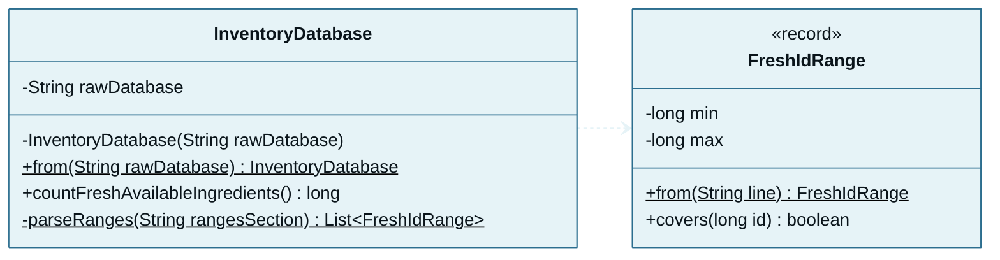
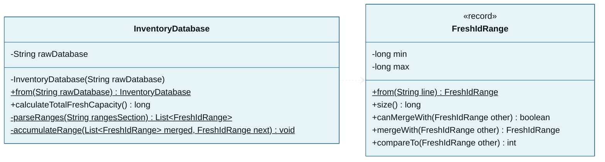

# Diagramas de Clases - Día 5

## Día 5 - Parte A

```mermaid
%%{init: {
  'theme': 'base',
  'themeVariables': {
    'background': '#0A141A',
    'primaryColor': '#E6F3F7',
    'primaryTextColor': '#0A141A',
    'primaryBorderColor': '#2C6E8F',
    'lineColor': '#E6F3F7',
    'secondaryColor': '#E6F3F7',
    'tertiaryColor': '#E6F3F7'
  }
}}%%
classDiagram
    direction LR
    class FreshIdRange {
        <<record>>
        -long min
        -long max
        +from(String line) FreshIdRange$
        +covers(long id) boolean
    }
    class InventoryDatabase {
        -String rawDatabase
        -InventoryDatabase(String rawDatabase)
        +from(String rawDatabase) InventoryDatabase$
        +countFreshAvailableIngredients() long
        -parseRanges(String rangesSection) List~FreshIdRange~$
    }

    InventoryDatabase ..> FreshIdRange
```

---

## Día 5 - Parte B

```mermaid
%%{init: {
  'theme': 'base',
  'themeVariables': {
    'background': '#0A141A',
    'primaryColor': '#E6F3F7',
    'primaryTextColor': '#0A141A',
    'primaryBorderColor': '#2C6E8F',
    'lineColor': '#E6F3F7',
    'secondaryColor': '#E6F3F7',
    'tertiaryColor': '#E6F3F7'
  }
}}%%
classDiagram
    direction LR
    class FreshIdRange {
        <<record>>
        -long min
        -long max
        +from(String line) FreshIdRange$
        +size() long
        +canMergeWith(FreshIdRange other) boolean
        +mergeWith(FreshIdRange other) FreshIdRange
        +compareTo(FreshIdRange other) int
    }
    class InventoryDatabase {
        -String rawDatabase
        -InventoryDatabase(String rawDatabase)
        +from(String rawDatabase) InventoryDatabase$
        +calculateTotalFreshCapacity() long
        -parseRanges(String rangesSection) List~FreshIdRange~$
        -accumulateRange(List~FreshIdRange~ merged, FreshIdRange next) void$
    }

    InventoryDatabase ..> FreshIdRange
```
