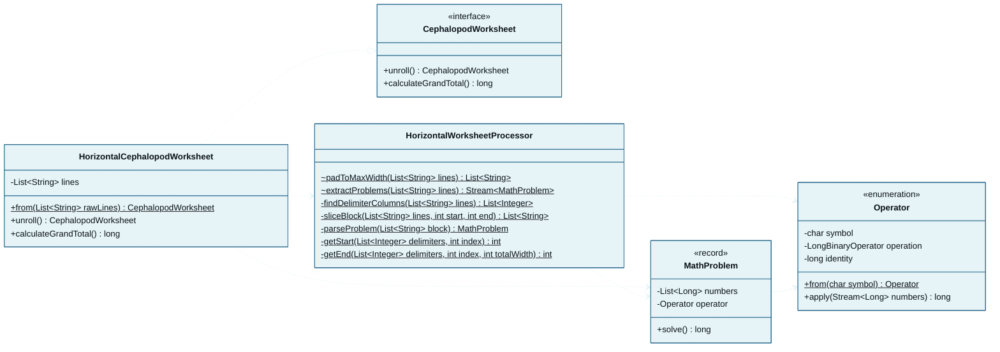
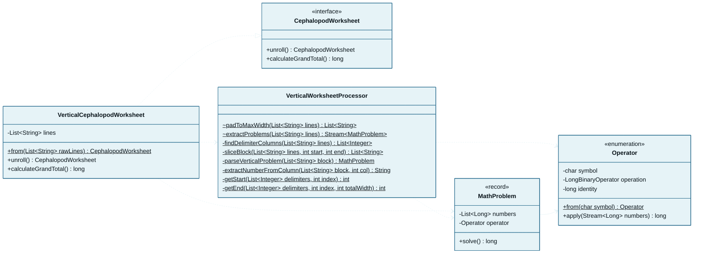

# Diagramas de Clases - Día 6

## Día 6 - Parte A

```mermaid
%%{init: {
  'theme': 'base',
  'themeVariables': {
    'background': '#0A141A',
    'primaryColor': '#E6F3F7',
    'primaryTextColor': '#0A141A',
    'primaryBorderColor': '#2C6E8F',
    'lineColor': '#E6F3F7',
    'secondaryColor': '#E6F3F7',
    'tertiaryColor': '#E6F3F7'
  }
}}%%
classDiagram
    direction LR
    class CephalopodWorksheet {
        <<interface>>
        +unroll() CephalopodWorksheet
        +calculateGrandTotal() long
    }
    class HorizontalCephalopodWorksheet {
        -List~String~ lines
        +from(List~String~ rawLines) CephalopodWorksheet$
        +unroll() CephalopodWorksheet
        +calculateGrandTotal() long
    }
    class HorizontalWorksheetProcessor {
        ~padToMaxWidth(List~String~ lines) List~String~$
        ~extractProblems(List~String~ lines) Stream~MathProblem~$
        -findDelimiterColumns(List~String~ lines) List~Integer~$
        -sliceBlock(List~String~ lines, int start, int end) List~String~$
        -parseProblem(List~String~ block) MathProblem$
        -getStart(List~Integer~ delimiters, int index) int$
        -getEnd(List~Integer~ delimiters, int index, int totalWidth) int$
    }
    class MathProblem {
        <<record>>
        -List~Long~ numbers
        -Operator operator
        +solve() long
    }
    class Operator {
        <<enumeration>>
        -char symbol
        -LongBinaryOperator operation
        -long identity
        +from(char symbol) Operator$
        +apply(Stream~Long~ numbers) long
    }

    HorizontalCephalopodWorksheet ..|> CephalopodWorksheet
    HorizontalCephalopodWorksheet ..> HorizontalWorksheetProcessor
    HorizontalCephalopodWorksheet ..> MathProblem
    HorizontalWorksheetProcessor ..> MathProblem
    HorizontalWorksheetProcessor ..> Operator
    MathProblem --> Operator
```

---

## Día 6 - Parte B

```mermaid
%%{init: {
  'theme': 'base',
  'themeVariables': {
    'background': '#0A141A',
    'primaryColor': '#E6F3F7',
    'primaryTextColor': '#0A141A',
    'primaryBorderColor': '#2C6E8F',
    'lineColor': '#E6F3F7',
    'secondaryColor': '#E6F3F7',
    'tertiaryColor': '#E6F3F7'
  }
}}%%
classDiagram
    direction LR
    class CephalopodWorksheet {
        <<interface>>
        +unroll() CephalopodWorksheet
        +calculateGrandTotal() long
    }
    class VerticalCephalopodWorksheet {
        -List~String~ lines
        +from(List~String~ rawLines) CephalopodWorksheet$
        +unroll() CephalopodWorksheet
        +calculateGrandTotal() long
    }
    class VerticalWorksheetProcessor {
        ~padToMaxWidth(List~String~ lines) List~String~$
        ~extractProblems(List~String~ lines) Stream~MathProblem~$
        -findDelimiterColumns(List~String~ lines) List~Integer~$
        -sliceBlock(List~String~ lines, int start, int end) List~String~$
        -parseVerticalProblem(List~String~ block) MathProblem$
        -extractNumberFromColumn(List~String~ block, int col) String$
        -getStart(List~Integer~ delimiters, int index) int$
        -getEnd(List~Integer~ delimiters, int index, int totalWidth) int$
    }
    class MathProblem {
        <<record>>
        -List~Long~ numbers
        -Operator operator
        +solve() long
    }
    class Operator {
        <<enumeration>>
        -char symbol
        -LongBinaryOperator operation
        -long identity
        +from(char symbol) Operator$
        +apply(Stream~Long~ numbers) long
    }

    VerticalCephalopodWorksheet ..|> CephalopodWorksheet
    VerticalCephalopodWorksheet ..> VerticalWorksheetProcessor
    VerticalCephalopodWorksheet ..> MathProblem
    VerticalWorksheetProcessor ..> MathProblem
    VerticalWorksheetProcessor ..> Operator
    MathProblem --> Operator
```
