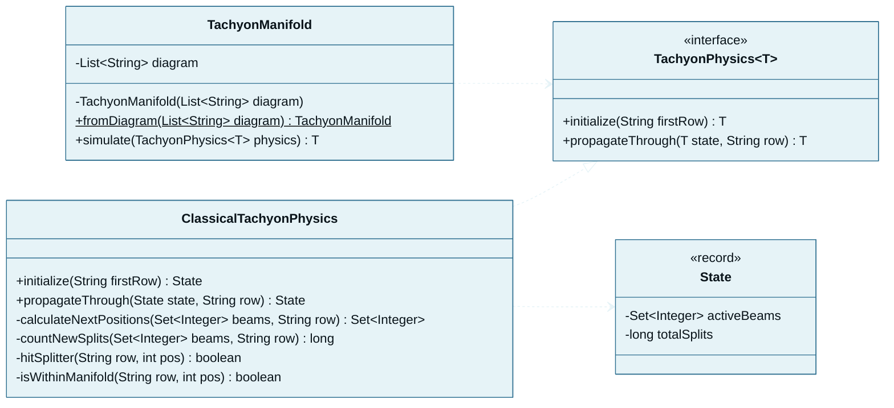
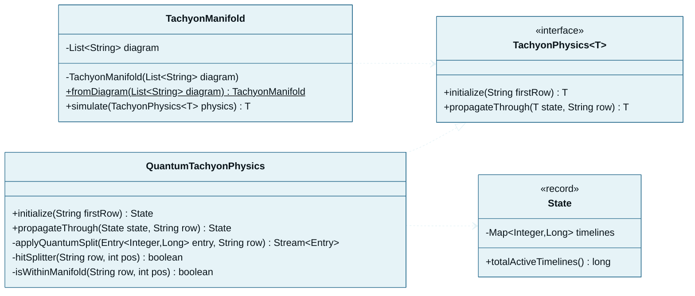

# Diagramas de Clases - Día 7

## Día 7 - Parte A

```mermaid
%%{init: {
  'theme': 'base',
  'themeVariables': {
    'background': '#0A141A',
    'primaryColor': '#E6F3F7',
    'primaryTextColor': '#0A141A',
    'primaryBorderColor': '#2C6E8F',
    'lineColor': '#E6F3F7',
    'secondaryColor': '#E6F3F7',
    'tertiaryColor': '#E6F3F7'
  }
}}%%
classDiagram
    direction LR
    class TachyonPhysics~T~ {
        <<interface>>
        +initialize(String firstRow) T
        +propagateThrough(T state, String row) T
    }
    class TachyonManifold {
        -List~String~ diagram
        -TachyonManifold(List~String~ diagram)
        +fromDiagram(List~String~ diagram) TachyonManifold$
        +simulate(TachyonPhysics~T~ physics) T
    }
    class ClassicalTachyonPhysics {
        +initialize(String firstRow) State
        +propagateThrough(State state, String row) State
        -calculateNextPositions(Set~Integer~ beams, String row) Set~Integer~
        -countNewSplits(Set~Integer~ beams, String row) long
        -hitSplitter(String row, int pos) boolean
        -isWithinManifold(String row, int pos) boolean
    }
    class State {
        <<record>>
        -Set~Integer~ activeBeams
        -long totalSplits
    }

    TachyonManifold ..> TachyonPhysics
    ClassicalTachyonPhysics ..|> TachyonPhysics
    ClassicalTachyonPhysics ..> State
```

---

## Día 7 - Parte B

```mermaid
%%{init: {
  'theme': 'base',
  'themeVariables': {
    'background': '#0A141A',
    'primaryColor': '#E6F3F7',
    'primaryTextColor': '#0A141A',
    'primaryBorderColor': '#2C6E8F',
    'lineColor': '#E6F3F7',
    'secondaryColor': '#E6F3F7',
    'tertiaryColor': '#E6F3F7'
  }
}}%%
classDiagram
    direction LR
    class TachyonPhysics~T~ {
        <<interface>>
        +initialize(String firstRow) T
        +propagateThrough(T state, String row) T
    }
    class TachyonManifold {
        -List~String~ diagram
        -TachyonManifold(List~String~ diagram)
        +fromDiagram(List~String~ diagram) TachyonManifold$
        +simulate(TachyonPhysics~T~ physics) T
    }
    class QuantumTachyonPhysics {
        +initialize(String firstRow) State
        +propagateThrough(State state, String row) State
        -applyQuantumSplit(Entry~Integer,Long~ entry, String row) Stream~Entry~
        -hitSplitter(String row, int pos) boolean
        -isWithinManifold(String row, int pos) boolean
    }
    class State {
        <<record>>
        -Map~Integer,Long~ timelines
        +totalActiveTimelines() long
    }

    TachyonManifold ..> TachyonPhysics
    QuantumTachyonPhysics ..|> TachyonPhysics
    QuantumTachyonPhysics ..> State
```
