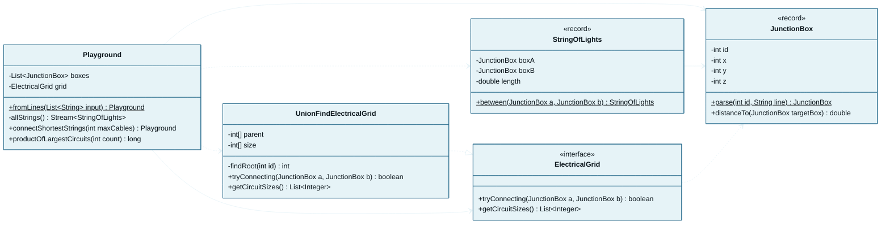
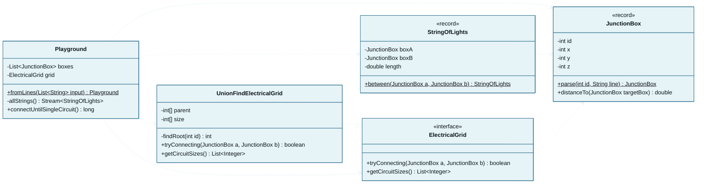

# Diagramas de Clases - Día 8

## Día 8 - Parte A

```mermaid
%%{init: {
  'theme': 'base',
  'themeVariables': {
    'background': '#0A141A',
    'primaryColor': '#E6F3F7',
    'primaryTextColor': '#0A141A',
    'primaryBorderColor': '#2C6E8F',
    'lineColor': '#E6F3F7',
    'secondaryColor': '#E6F3F7',
    'tertiaryColor': '#E6F3F7'
  }
}}%%
classDiagram
    direction LR
    class JunctionBox {
        <<record>>
        -int id
        -int x
        -int y
        -int z
        +parse(int id, String line) JunctionBox$
        +distanceTo(JunctionBox targetBox) double
    }
    class StringOfLights {
        <<record>>
        -JunctionBox boxA
        -JunctionBox boxB
        -double length
        +between(JunctionBox a, JunctionBox b) StringOfLights$
    }
    class ElectricalGrid {
        <<interface>>
        +tryConnecting(JunctionBox a, JunctionBox b) boolean
        +getCircuitSizes() List~Integer~
    }
    class UnionFindElectricalGrid {
        -int[] parent
        -int[] size
        -findRoot(int id) int
        +tryConnecting(JunctionBox a, JunctionBox b) boolean
        +getCircuitSizes() List~Integer~
    }
    class Playground {
        -List~JunctionBox~ boxes
        -ElectricalGrid grid
        +fromLines(List~String~ input) Playground$
        -allStrings() Stream~StringOfLights~
        +connectShortestStrings(int maxCables) Playground
        +productOfLargestCircuits(int count) long
    }

    UnionFindElectricalGrid ..|> ElectricalGrid
    Playground --> ElectricalGrid
    Playground --> JunctionBox
    StringOfLights --> JunctionBox
    Playground ..> StringOfLights
    Playground ..> UnionFindElectricalGrid
    ElectricalGrid ..> JunctionBox
```

---

## Día 8 - Parte B

```mermaid
%%{init: {
  'theme': 'base',
  'themeVariables': {
    'background': '#0A141A',
    'primaryColor': '#E6F3F7',
    'primaryTextColor': '#0A141A',
    'primaryBorderColor': '#2C6E8F',
    'lineColor': '#E6F3F7',
    'secondaryColor': '#E6F3F7',
    'tertiaryColor': '#E6F3F7'
  }
}}%%
classDiagram
    direction LR
    class JunctionBox {
        <<record>>
        -int id
        -int x
        -int y
        -int z
        +parse(int id, String line) JunctionBox$
        +distanceTo(JunctionBox targetBox) double
    }
    class StringOfLights {
        <<record>>
        -JunctionBox boxA
        -JunctionBox boxB
        -double length
        +between(JunctionBox a, JunctionBox b) StringOfLights$
    }
    class ElectricalGrid {
        <<interface>>
        +tryConnecting(JunctionBox a, JunctionBox b) boolean
        +getCircuitSizes() List~Integer~
    }
    class UnionFindElectricalGrid {
        -int[] parent
        -int[] size
        -findRoot(int id) int
        +tryConnecting(JunctionBox a, JunctionBox b) boolean
        +getCircuitSizes() List~Integer~
    }
    class Playground {
        -List~JunctionBox~ boxes
        -ElectricalGrid grid
        +fromLines(List~String~ input) Playground$
        -allStrings() Stream~StringOfLights~
        +connectUntilSingleCircuit() long
    }

    UnionFindElectricalGrid ..|> ElectricalGrid
    Playground --> ElectricalGrid
    Playground --> JunctionBox
    StringOfLights --> JunctionBox
    Playground ..> StringOfLights
    Playground ..> UnionFindElectricalGrid
    ElectricalGrid ..> JunctionBox
```
