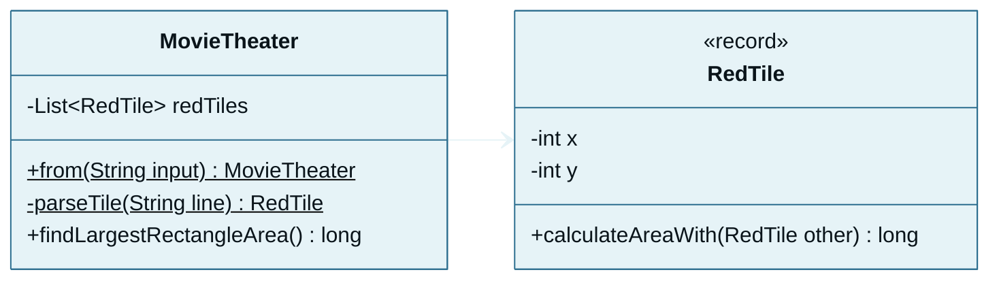
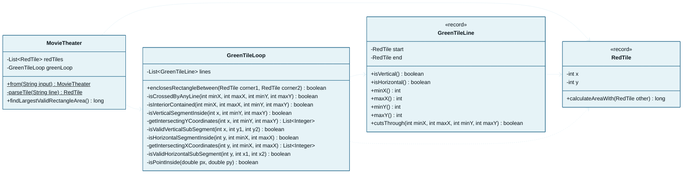

# Diagramas de Clases - Día 9

## Día 9 - Parte A

```mermaid
%%{init: {
  'theme': 'base',
  'themeVariables': {
    'background': '#0A141A',
    'primaryColor': '#E6F3F7',
    'primaryTextColor': '#0A141A',
    'primaryBorderColor': '#2C6E8F',
    'lineColor': '#E6F3F7',
    'secondaryColor': '#E6F3F7',
    'tertiaryColor': '#E6F3F7'
  }
}}%%
classDiagram
    direction LR
    class RedTile {
        <<record>>
        -int x
        -int y
        +calculateAreaWith(RedTile other) long
    }
    class MovieTheater {
        -List~RedTile~ redTiles
        +from(String input) MovieTheater$
        -parseTile(String line) RedTile$
        +findLargestRectangleArea() long
    }

    MovieTheater --> RedTile
```

---

## Día 9 - Parte B

```mermaid
%%{init: {
  'theme': 'base',
  'themeVariables': {
    'background': '#0A141A',
    'primaryColor': '#E6F3F7',
    'primaryTextColor': '#0A141A',
    'primaryBorderColor': '#2C6E8F',
    'lineColor': '#E6F3F7',
    'secondaryColor': '#E6F3F7',
    'tertiaryColor': '#E6F3F7'
  }
}}%%
classDiagram
    direction LR
    class RedTile {
        <<record>>
        -int x
        -int y
        +calculateAreaWith(RedTile other) long
    }
    class GreenTileLine {
        <<record>>
        -RedTile start
        -RedTile end
        +isVertical() boolean
        +isHorizontal() boolean
        +minX() int
        +maxX() int
        +minY() int
        +maxY() int
        +cutsThrough(int minX, int maxX, int minY, int maxY) boolean
    }
    class GreenTileLoop {
        -List~GreenTileLine~ lines
        +enclosesRectangleBetween(RedTile corner1, RedTile corner2) boolean
        -isCrossedByAnyLine(int minX, int maxX, int minY, int maxY) boolean
        -isInteriorContained(int minX, int maxX, int minY, int maxY) boolean
        -isVerticalSegmentInside(int x, int minY, int maxY) boolean
        -getIntersectingYCoordinates(int x, int minY, int maxY) List~Integer~
        -isValidVerticalSubSegment(int x, int y1, int y2) boolean
        -isHorizontalSegmentInside(int y, int minX, int maxX) boolean
        -getIntersectingXCoordinates(int y, int minX, int maxX) List~Integer~
        -isValidHorizontalSubSegment(int y, int x1, int x2) boolean
        -isPointInside(double px, double py) boolean
    }
    class MovieTheater {
        -List~RedTile~ redTiles
        -GreenTileLoop greenLoop
        +from(String input) MovieTheater$
        -parseTile(String line) RedTile$
        +findLargestValidRectangleArea() long
    }

    MovieTheater --> RedTile
    MovieTheater --> GreenTileLoop
    GreenTileLoop --> GreenTileLine
    GreenTileLine --> RedTile
    GreenTileLoop ..> RedTile
```
