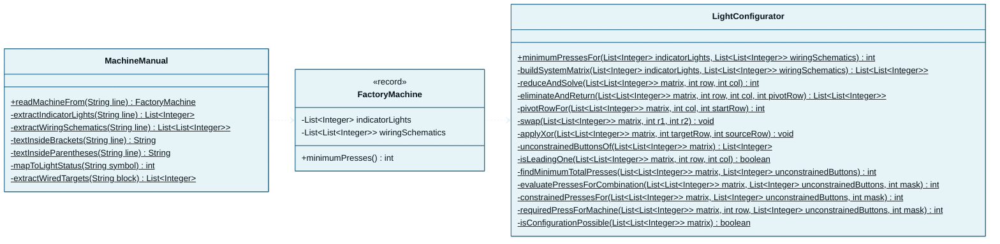

# Diagramas de Clases - Día 10

## Día 10 - Parte A

```mermaid
%%{init: {
  'theme': 'base',
  'themeVariables': {
    'background': '#0A141A',
    'primaryColor': '#E6F3F7',
    'primaryTextColor': '#0A141A',
    'primaryBorderColor': '#2C6E8F',
    'lineColor': '#E6F3F7',
    'secondaryColor': '#E6F3F7',
    'tertiaryColor': '#E6F3F7'
  }
}}%%
classDiagram
    direction LR
    class FactoryMachine {
        <<record>>
        -List~Integer~ indicatorLights
        -List~List~Integer~~ wiringSchematics
        +minimumPresses() int
    }
    class MachineManual {
        +readMachineFrom(String line) FactoryMachine$
        -extractIndicatorLights(String line) List~Integer~$
        -extractWiringSchematics(String line) List~List~Integer~~$
        -textInsideBrackets(String line) String$
        -textInsideParentheses(String line) String$
        -mapToLightStatus(String symbol) int$
        -extractWiredTargets(String block) List~Integer~$
    }
    class LightConfigurator {
        +minimumPressesFor(List~Integer~ indicatorLights, List~List~Integer~~ wiringSchematics) int$
        -buildSystemMatrix(List~Integer~ indicatorLights, List~List~Integer~~ wiringSchematics) List~List~Integer~~$
        -reduceAndSolve(List~List~Integer~~ matrix, int row, int col) int$
        -eliminateAndReturn(List~List~Integer~~ matrix, int row, int col, int pivotRow) List~List~Integer~~$
        -pivotRowFor(List~List~Integer~~ matrix, int col, int startRow) int$
        -swap(List~List~Integer~~ matrix, int r1, int r2) void$
        -applyXor(List~List~Integer~~ matrix, int targetRow, int sourceRow) void$
        -unconstrainedButtonsOf(List~List~Integer~~ matrix) List~Integer~$
        -isLeadingOne(List~List~Integer~~ matrix, int row, int col) boolean$
        -findMinimumTotalPresses(List~List~Integer~~ matrix, List~Integer~ unconstrainedButtons) int$
        -evaluatePressesForCombination(List~List~Integer~~ matrix, List~Integer~ unconstrainedButtons, int mask) int$
        -constrainedPressesFor(List~List~Integer~~ matrix, List~Integer~ unconstrainedButtons, int mask) int$
        -requiredPressForMachine(List~List~Integer~~ matrix, int row, List~Integer~ unconstrainedButtons, int mask) int$
        -isConfigurationPossible(List~List~Integer~~ matrix) boolean$
    }

    MachineManual ..> FactoryMachine
    FactoryMachine ..> LightConfigurator
```

---

## Día 10 - Parte B

```mermaid
%%{init: {
  'theme': 'base',
  'themeVariables': {
    'background': '#0A141A',
    'primaryColor': '#E6F3F7',
    'primaryTextColor': '#0A141A',
    'primaryBorderColor': '#2C6E8F',
    'lineColor': '#E6F3F7',
    'secondaryColor': '#E6F3F7',
    'tertiaryColor': '#E6F3F7'
  }
}}%%
classDiagram
    direction LR
    class FactoryMachine {
        <<record>>
        -List~Integer~ joltageTargets
        -List~List~Integer~~ wiringSchematics
        +minimumJoltagePresses() long
    }
    class MachineManual {
        +readMachineFrom(String line) FactoryMachine$
        -extractJoltageTargets(String line) List~Integer~$
        -extractWiringSchematics(String line) List~List~Integer~~$
        -textInsideKeys(String line) String$
        -textInsideParentheses(String line) String$
        -extractWiredTargets(String block) List~Integer~$
    }
    class JoltageConfigurator {
        +minimumPressesToAchieve(List~Integer~ targets, List~List~Integer~~ schematics) long$
        -findMinimumPresses(List~Integer~ targets, List~List~Integer~~ schematics, Map~List~Integer~,Long~ memo) long$
        -isFullyConfigured(List~Integer~ targets) boolean$
        -isConfigurationFeasible(List~Integer~ targets, List~List~Integer~~ schematics, int mask) boolean$
        -calculateButtonImpact(List~List~Integer~~ schematics, int mask, int counterIndex) int$
        -calculateTotalCost(List~Integer~ targets, List~List~Integer~~ schematics, int mask, Map~List~Integer~,Long~ memo) long$
        -nextJoltageState(List~Integer~ targets, List~List~Integer~~ schematics, int mask) List~Integer~$
    }

    MachineManual ..> FactoryMachine
    FactoryMachine ..> JoltageConfigurator
```
