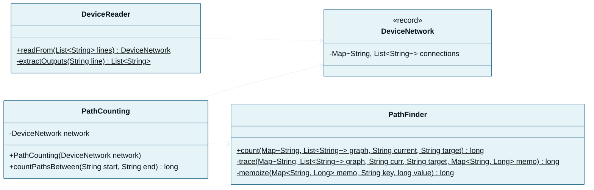
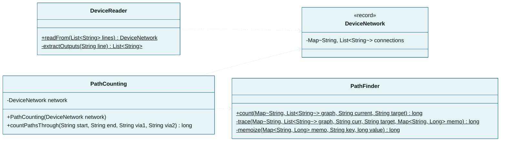

# Diagramas de Clases - Día 11

## Día 11 - Parte A

```mermaid
%%{init: {
  'theme': 'base',
  'themeVariables': {
    'background': '#0A141A',
    'primaryColor': '#E6F3F7',
    'primaryTextColor': '#0A141A',
    'primaryBorderColor': '#2C6E8F',
    'lineColor': '#E6F3F7',
    'secondaryColor': '#E6F3F7',
    'tertiaryColor': '#E6F3F7'
  }
}}%%
classDiagram
    direction LR
    class DeviceNetwork {
        <<record>>
        -Map~String, List~String~~ connections
    }
    class DeviceReader {
        +readFrom(List~String~ lines) DeviceNetwork$
        -extractOutputs(String line) List~String~$
    }
    class PathFinder {
        +count(Map~String, List~String~~ graph, String current, String target) long$
        -trace(Map~String, List~String~~ graph, String curr, String target, Map~String, Long~ memo) long$
        -memoize(Map~String, Long~ memo, String key, long value) long$
    }
    class PathCounting {
        -DeviceNetwork network
        +PathCounting(DeviceNetwork network)
        +countPathsBetween(String start, String end) long
    }

    DeviceReader ..> DeviceNetwork
    PathCounting --> DeviceNetwork
    PathCounting ..> PathFinder
```

---

## Día 11 - Parte B

```mermaid
%%{init: {
  'theme': 'base',
  'themeVariables': {
    'background': '#0A141A',
    'primaryColor': '#E6F3F7',
    'primaryTextColor': '#0A141A',
    'primaryBorderColor': '#2C6E8F',
    'lineColor': '#E6F3F7',
    'secondaryColor': '#E6F3F7',
    'tertiaryColor': '#E6F3F7'
  }
}}%%
classDiagram
    direction LR
    class DeviceNetwork {
        <<record>>
        -Map~String, List~String~~ connections
    }
    class DeviceReader {
        +readFrom(List~String~ lines) DeviceNetwork$
        -extractOutputs(String line) List~String~$
    }
    class PathFinder {
        +count(Map~String, List~String~~ graph, String current, String target) long$
        -trace(Map~String, List~String~~ graph, String curr, String target, Map~String, Long~ memo) long$
        -memoize(Map~String, Long~ memo, String key, long value) long$
    }
    class PathCounting {
        -DeviceNetwork network
        +PathCounting(DeviceNetwork network)
        +countPathsThrough(String start, String end, String via1, String via2) long
    }

    DeviceReader ..> DeviceNetwork
    PathCounting --> DeviceNetwork
    PathCounting ..> PathFinder
```
