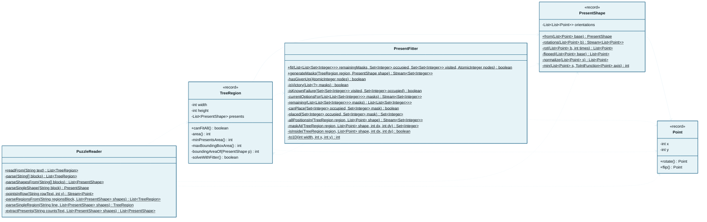

# Diagramas de Clases - Día 12

## Día 12 - Parte A

```mermaid
%%{init: {
  'theme': 'base',
  'themeVariables': {
    'background': '#0A141A',
    'primaryColor': '#E6F3F7',
    'primaryTextColor': '#0A141A',
    'primaryBorderColor': '#2C6E8F',
    'lineColor': '#E6F3F7',
    'secondaryColor': '#E6F3F7',
    'tertiaryColor': '#E6F3F7'
  }
}}%%
classDiagram
    direction LR
    class Point {
        <<record>>
        -int x
        -int y
        +rotate() Point
        +flip() Point
    }
    class PresentShape {
        <<record>>
        -List~List~Point~~ orientations
        +from(List~Point~ base) PresentShape$
        -rotations(List~Point~ b) Stream~List~Point~~$
        -rot(List~Point~ b, int times) List~Point~$
        -flipped(List~Point~ base) List~Point~$
        -normalize(List~Point~ s) List~Point~$
        -min(List~Point~ s, ToIntFunction~Point~ axis) int$
    }
    class TreeRegion {
        <<record>>
        -int width
        -int height
        -List~PresentShape~ presents
        +canFitAll() boolean
        -area() int
        -minPresentsArea() int
        -maxBoundingBoxArea() int
        -boundingAreaOf(PresentShape p) int
        -solveWithFitter() boolean
    }
    class PresentFitter {
        +fit(List~List~Set~Integer~~~ remainingMasks, Set~Integer~ occupied, Set~Set~Integer~~ visited, AtomicInteger nodes) boolean$
        +generateMasks(TreeRegion region, PresentShape shape) Stream~Set~Integer~~$
        -hasGivenUp(AtomicInteger nodes) boolean$
        -isVictory(List~?~ masks) boolean$
        -isKnownFailure(Set~Set~Integer~~ visited, Set~Integer~ occupied) boolean$
        -currentOptionsFor(List~List~Set~Integer~~~ masks) Stream~Set~Integer~~$
        -remaining(List~List~Set~Integer~~~ masks) List~List~Set~Integer~~~$
        -canPlace(Set~Integer~ occupied, Set~Integer~ mask) boolean$
        -placed(Set~Integer~ occupied, Set~Integer~ mask) Set~Integer~$
        -allPositionsIn(TreeRegion region, List~Point~ shape) Stream~Set~Integer~~$
        -maskAt(TreeRegion region, List~Point~ shape, int dx, int dy) Set~Integer~$
        -isInside(TreeRegion region, List~Point~ shape, int dx, int dy) boolean$
        -to1D(int width, int x, int y) int$
    }
    class PuzzleReader {
        +readFrom(String text) List~TreeRegion~$
        -parse(String[] blocks) List~TreeRegion~$
        -parseShapesFrom(String[] blocks) List~PresentShape~$
        -parseSingleShape(String block) PresentShape$
        -pointsInRow(String rowText, int y) Stream~Point~$
        -parseRegionsFrom(String regionsBlock, List~PresentShape~ shapes) List~TreeRegion~$
        -parseSingleRegion(String line, List~PresentShape~ shapes) TreeRegion$
        -extractPresents(String countsText, List~PresentShape~ shapes) List~PresentShape~$
    }

    TreeRegion --> PresentShape
    PresentShape --> Point
    PuzzleReader ..> TreeRegion
    PuzzleReader ..> PresentShape
    PuzzleReader ..> Point
    TreeRegion ..> PresentFitter
    TreeRegion ..> Point
    PresentFitter ..> TreeRegion
    PresentFitter ..> PresentShape
    PresentFitter ..> Point
```
