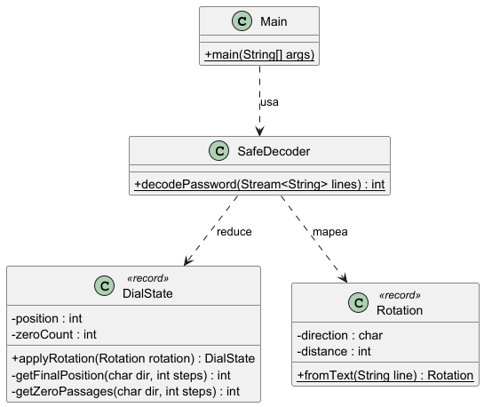
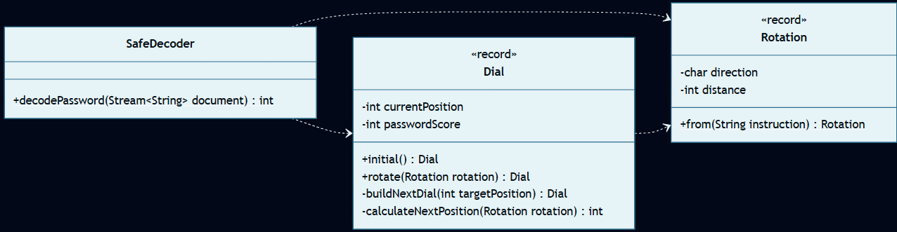

# Día 1: Secret Entrance

## El Reto
### Parte A
Disponemos de un documento con instrucciones para girar el dial de una caja fuerte (numerado del 0 al 99). Las instrucciones indican la dirección y la cantidad de clics (por ejemplo, `R8` para derecha, `L19` para izquierda). El dial comienza en el 50. El objetivo es calcular la verdadera contraseña, que equivale al número de veces que el dial se detiene exactamente en el 0 al final de cualquier rotación.

### Parte B
Descubrimos un nuevo protocolo de seguridad llamado método `0x434C49434B`. Las reglas cambian: ahora debemos contar cada vez que el dial pasa por el 0 durante el giro, y no solo al finalizar la rotación. Por ejemplo, un giro inmenso de `R1000` hará que el dial cruce el cero 10 veces en un solo movimiento. La contraseña final es la suma de todas estas intersecciones.

---

## Diagramas
*Diagrama de clases parte 1:*

*Diagrama de clases parte 2:*

## Lógica Estructural
* **`Rotation`**: [`Rotation`](Rotation.java) - Modelo de datos común (inmutable). Recibe la cadena de texto cruda y la traduce a una instrucción estructurada con dirección (`char`) y distancia (`int`).
* **`Dial`**: (Parte A: [`Dial`](a/Dial.java) / Parte B: [`Dial`](b/Dial.java)) - Representa el estado inmutable de la rueda de la caja fuerte (posición actual y puntuación acumulada). Contiene la lógica matemática para transicionar a un nuevo estado tras aplicar una rotación.
* **`SafeDecoder`**: (Parte A: [`SafeDecoder`](a/SafeDecoder.java) / Parte B: [`SafeDecoder`](b/SafeDecoder.java)) - Se encarga de procesar el flujo completo del documento, aplicando las rotaciones al dial de forma secuencial.

## Algoritmos

* **Aritmética Modular Circular:** Para calcular las posiciones en un espacio cerrado (0-99), se utiliza el operador módulo (`%`). Se aplica la fórmula de compensación `((pos - steps) % 100 + 100) % 100` para rotaciones a la izquierda, garantizando que el dial se comporte correctamente en un plano circular y evitando errores de desbordamiento en índices negativos. (Ver cálculo en [`Dial.java (A)`](a/Dial.java)).

---

## Fundamentos

* **Abstracción** *(Simplificación de detalles complejos mediante interfaces o contratos claros)*: `SafeDecoder` interactúa exclusivamente con el contrato público de [`Dial`](a/Dial.java) (su método `rotate`), abstrayéndose por completo de los detalles matemáticos e internos de cómo se realiza el giro.

* **Modularidad** *(División del programa en módulos bien definidos e independientes)*: Se dividen responsabilidades en el parser [`Rotation`](Rotation.java), el modelo matemático [`Dial`](a/Dial.java) y el orquestador [`SafeDecoder`](a/SafeDecoder.java).

* **Alta Cohesión y Bajo Acoplamiento** *(Los módulos hacen una sola cosa y dependen mínimamente entre sí)*: Existe alta cohesión porque cada clase tiene un único propósito muy focalizado (`Dial` gestiona la matemática, `Rotation` parsea texto, y `SafeDecoder` exclusivamente orquesta el flujo). A su vez, el acoplamiento es bajo porque `SafeDecoder` enlaza a los modelos mediante Streams sin que estos se conozcan directamente entre sí.

* **Código Expresivo** *(Código autoexplicativo, limpio y fácil de leer)*: El método `rotate` en [`Dial`](a/Dial.java) se lee casi como lenguaje natural (`return buildNextDial(calculateNextPosition(rotation));`), aislando el "qué hace" (girar hacia la nueva posición) del "cómo lo hace" (las complejas fórmulas del módulo).

## Principios de Diseño
* **SOLID:**
    * **Single Responsibility Principle (SRP)** *(Una clase debe tener un único motivo para cambiar)*: [`Rotation`](Rotation.java) únicamente se encarga de analizar strings, [`Dial`](a/Dial.java) gestiona el estado matemático del dial, y `SafeDecoder` actúa exclusivamente como orquestador del flujo.
    * **Open/Closed Principle (OCP)** *(Abierto a la extensión, cerrado a la modificación)*: `SafeDecoder` está abierto a procesar datos de cualquier fuente (archivos, memoria, red) sin modificar su código interno, ya que el origen de los datos se le inyecta desde el exterior.
    * **Dependency Inversion Principle (DIP)** *(Depender de abstracciones, no de clases concretas)*: `SafeDecoder` depende de la interfaz genérica `Stream<String>` nativa de Java, en lugar de acoplarse a clases concretas de lectura de ficheros (como `Scanner` o `BufferedReader`).

* **Don't Repeat Yourself (DRY)** *(Evitar la duplicación de lógica)*: La lógica del modelo [`Rotation`](Rotation.java) se comparte tanto en la Parte A como en la Parte B del reto.

* **Law of Demeter (LoD)** *(Una unidad debe tener un conocimiento limitado de otras unidades)*: [`SafeDecoder`](a/SafeDecoder.java) le ordena al dial rotar a través de `Dial::rotate` en vez de extraer sus componentes y recalcular externamente.

* **Keep It Simple, Stupid (KISS) & YAGNI** *(Simplicidad y no añadir código innecesario)*: El modelado se limita exclusivamente a resolver el reto mediante `records` simples de Java sin sobrediseñar abstracciones de base de datos o interfaces innecesarias.

## Técnicas
* **Inmutabilidad del Modelo** *(Uso de estados que no cambian una vez creados)*: Tanto [`Rotation`](Rotation.java) como [`Dial`](a/Dial.java) se definen como `record`, asegurando la inmutabilidad del sistema.

* **Métodos Delegados** *(Dividir tareas complejas y delegar sub-operaciones)*: El método principal `rotate` en [`Dial (A)`](a/Dial.java) delega el cálculo de posición en `calculateNextPosition` y la generación del nuevo objeto en `buildNextDial`.

* **Inyección de Dependencias (por método)** *(Pasar colaboradores/datos desde el exterior en lugar de instanciarlos internamente)*: En lugar de que `SafeDecoder` cree su propio lector de archivos y se acople al disco duro, la fuente de datos (`Stream<String>`) se le "inyecta" por parámetro. Esto permite aislarlo y testearlo fácilmente en memoria.

* **Inversión del Control (IoC)** *(Delegar el control del flujo o dependencias al exterior)*: Al inyectar el `Stream<String>` en `SafeDecoder`, es el código cliente quien controla de dónde vienen los datos. Además, al usar la API de Streams, se delega el control de los bucles (iteración interna) a Java en lugar de escribir un `for` manual.

* **Good Naming** *(Nombres descriptivos y precisos)*: Uso de términos claros y alineados al dominio como `currentPosition`, `passwordScore` y `decodePassword`.

* **Fluent API** *(Encadenamiento de métodos para crear un flujo de lectura fluido)*: En [`Dial (B)`](b/Dial.java) se utiliza una tubería funcional encadenada (`IntStream.rangeClosed(...).map(...).filter(...).count()`) que permite leer el algoritmo secuencialmente: *"Genera el rango de pasos, mapea cada paso a su posición, filtra solo los que pasen por el cero, y cuéntalos"*.

## Patrones de Diseño

* **Factory Method (Creacional)** *(Encapsulación de la creación de objetos en métodos estáticos dedicados)*: `Rotation.from(instruction)` ([`Rotation`](Rotation.java)) y `Dial.initial()` ([`Dial`](a/Dial.java)) actúan como factorías para aislar la instanciación de objetos válidos del cliente.

## Paradigmas

* **Orientación a Objetos** *(Organización del software en objetos que encapsulan estado y comportamiento)*: Destaca el uso de un fuerte **Encapsulamiento**, modelando el dominio y la algoritmia de la caja fuerte con responsabilidades claras y aisladas dentro del objeto `Dial`.

* **Programación Funcional** *(Estilo declarativo basado en funciones puras y datos inmutables)*: Destaca el uso de sus pilares fundamentales: la absoluta **Inmutabilidad** (al rotar el `Dial` siempre se devuelve una instancia inmutable nueva en lugar de mutar variables de estado) y el **Estilo Declarativo** de los *pipelines* (Streams) empleados en el `SafeDecoder`.

---

## Verificación y Tests
Las soluciones se validan de forma automática mediante pruebas unitarias escritas con JUnit 5 y AssertJ, estructuradas semánticamente siguiendo el patrón Given-When-Then (Dado un contexto, Cuando ocurre una acción, Entonces se espera un resultado). Esta estructura, heredada del enfoque BDD (Behavior-Driven Development), orienta los tests a comprobar el comportamiento del sistema maximizando su legibilidad.

* **Parte A:** [`aTest`](../../../../../../test/java/test/day01/aTest.java) - Verifica la decodificación correcta de la secuencia del dial de la caja fuerte siguiendo las reglas tradicionales de detenerse en el 0 (resultado esperado = `3`).
* **Parte B:** [`bTest`](../../../../../../test/java/test/day01/bTest.java) - Verifica la lógica del método `0x434C49434B` contando las intersecciones en tránsito de cada giro (resultado esperado = `1003`).

