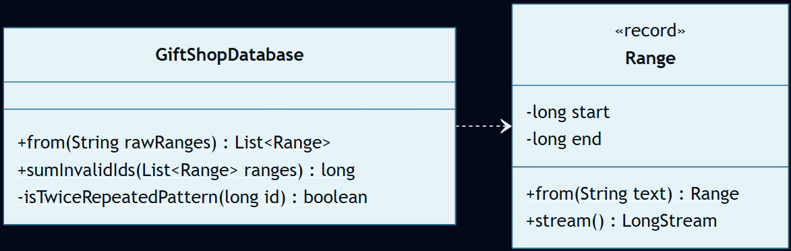
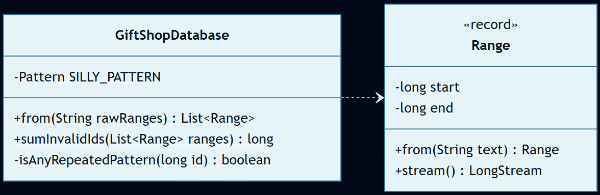

# Día 2: Gift Shop

## El Reto
### Parte A
Los elfos de la tienda de regalos necesitan limpiar su base de datos. Recibimos un registro con listas de rangos de números (por ejemplo, `11-22`). El objetivo es identificar y sumar todos los IDs inválidos. En esta primera fase, un ID se considera inválido si sus dígitos forman un patrón simétrico que se repite exactamente dos veces (por ejemplo, `1212`, donde la primera mitad es idéntica a la segunda).

### Parte B
Ahora, un ID se considera inválido si está formado por cualquier patrón repetido, sin importar si se repite 2, 3 o más veces (por ejemplo, `123123` o `1111`). El objetivo vuelve a ser calcular la suma total final de los IDs inválidos bajo esta nueva premisa procesando los mismos rangos.

---

## Diagramas
*Diagrama de clases parte 1:*

*Diagrama de clases parte 2:*

## Lógica Estructural
* **`Range`**: [`Range`](Range.java) - Modelo de dominio de datos implementado como un `record`. Encapsula el intervalo inicial y final, y su única responsabilidad es saber construirse a sí mismo desde un texto y generar los números que lo componen.
* **`GiftShopDatabase`**: (Parte A: [`GiftShopDatabase`](a/GiftShopDatabase.java) / Parte B: [`GiftShopDatabase`](b/GiftShopDatabase.java)) - Coordina el flujo de datos desde el parseo inicial, aplica los filtros de validación basados en las reglas elfas y agrega los resultados finales.

## Algoritmos
* **Filtrado por Patrones Regulares (Regex):** Se utiliza el motor de expresiones regulares para identificar secuencias repetitivas en los IDs. Para la Parte B, el patrón `^(.+)\1+$` detecta dinámicamente cualquier subcadena que se repita, independientemente de su longitud o cantidad de repeticiones (Ver [`GiftShopDatabase.java (B)`](b/GiftShopDatabase.java)).

---

## Fundamentos
* **Abstracción** *(Simplificación de detalles complejos mediante interfaces o contratos claros)*: La clase [`Range`](Range.java) abstrae la generación de números secuenciales mediante el método `expandToSequence()`, evitando que los clientes tengan que programar bucles manuales entre los límites.
* **Encapsulamiento** *(Ocultación del estado interno y protección de los datos)*: Los límites numéricos (inicio y fin) de cada rango están blindados dentro de `Range`. Nadie desde fuera puede alterarlos ni acceder a ellos para recalcular nada, todo se hace a través de la interfaz pública proporcionada por el objeto (el método `public`).
* **Modularidad** *(División del programa en módulos bien definidos e independientes)*: Se aísla el concepto de intervalo ([`Range`](Range.java)) del concepto del agregador de la base de datos ([`GiftShopDatabase`](a/GiftShopDatabase.java)).
* **Alta Cohesión y Bajo Acoplamiento** *(Los módulos hacen una sola cosa y dependen mínimamente entre sí)*: Existe alta cohesión porque `Range` solo define los límites matemáticos del intervalo y `GiftShopDatabase` asume la única responsabilidad de orquestar la identificación y suma de los códigos de regalo inválidos. El acoplamiento es bajo porque el orquestador (`GiftShopDatabase`) opera ciegamente sobre el `expandToSequence()` sin recalcular ni manipular los límites del rango manualmente.
* **Código Expresivo** *(Código autoexplicativo, limpio y fácil de leer)*: El uso de Streams permite leer el código casi como lenguaje natural. En `sumInvalidIds`, la línea `ranges.stream().flatMapToLong(Range::expandToSequence).filter(GiftShopDatabase::isTwiceRepeatedPattern).sum();` se lee textualmente como: "Toma los rangos, expándelos a una secuencia continua de IDs, quédate solo con aquellos que cumplan el patrón repetido, y súmalos todos".

## Principios de Diseño
* **SOLID**
    * **Single Responsibility Principle (SRP)** *(Una clase debe tener un único motivo para cambiar)*: [`Range`](Range.java) maneja exclusivamente límites del intervalo, mientras que [`GiftShopDatabase`](a/GiftShopDatabase.java) implementa las reglas de detección de IDs inválidos.
        
    * **Open/Closed Principle (OCP)** *(Abierto a la extensión, cerrado a la modificación)*: El sistema es flexible. Las reglas de validación se alteran o extienden en la parte B sin alterar en absoluto la estructura inmutable del objeto [`Range`](Range.java).

* **Don't Repeat Yourself (DRY)** *(Evitar la duplicación de lógica)*: La estructura de intervalos [`Range`](Range.java) y su factoría se comparten en su totalidad entre ambas implementaciones.
* **Law of Demeter (LoD) / Tell, Don't Ask** *(Evitar acoplamiento ordenando acciones en lugar de consultar estado interno)*: `GiftShopDatabase` no le pide a `Range` sus límites internos (`start`, `end`) para iterar manualmente sobre ellos, sino que le "ordena" expandirse (`expandToSequence()`), respetando su encapsulamiento al máximo.
* **Keep It Simple, Stupid (KISS)** *(Mantener el diseño lo más simple y directo posible)*: El parseo se realiza mediante operaciones sencillas de cadenas (`split`) sin requerir motores complejos o librerías adicionales de análisis sintáctico.

## Técnicas
* **Inmutabilidad del Modelo** *(Uso de estados que no cambian una vez creados)*: [`Range`](Range.java) está implementado como un `record`, impidiendo mutaciones en los límites una vez instanciado.
* **Métodos Delegados** *(Dividir tareas complejas y delegar sub-operaciones)*: El parseo de los extremos en `Range.from` ([`Range`](Range.java)) se delega en funciones estándar de Java como `split` y `trim`.
* **Inyección de Dependencias** *(Pasar colaboradores/datos en los parámetros de los métodos/constructores)*: La lista de rangos (`List<Range>`) se inyecta directamente al instanciar la `GiftShopDatabase`, desacoplándola de la lectura del fichero.
* **Inversión del Control (IoC)** *(Delegar el control del flujo a un motor o framework externo)*: El motor interno de Java Streams toma el control del bucle en `ranges.stream().flatMapToLong(...)`, liberando al programador de gestionar el estado iterativo.
* **Fluent API** *(Encadenamiento de métodos para crear un flujo de lectura fluido)*: En [`GiftShopDatabase (B)`](b/GiftShopDatabase.java) se utiliza una tubería funcional encadenada (`ranges.stream().flatMapToLong(Range::expandToSequence).filter(GiftShopDatabase::isTwiceRepeatedPattern).sum()`) que permite leer el algoritmo secuencialmente: *"Toma los rangos, expándelos a secuencias de números, filtra solo aquellos que cumplan el patrón repetitivo, y suma sus valores"*.
* **Good Naming** *(Nombres descriptivos y precisos)*: Uso de nombres claros del negocio elfo como `sumInvalidIds` e `isTwiceRepeatedPattern`.

## Patrones de Diseño
* **Factory Method (Creacional)** *(Encapsulación de la creación de objetos en métodos estáticos dedicados)*: Tanto `Range.from` como `GiftShopDatabase.from` encapsulan la lógica de instanciación a partir de textos planos. Esto aísla al resto del sistema de la estructura del fichero.

* **Closure (Funcional)** *(Expresiones que capturan el estado léxico de su entorno)*: Las lambdas del motor de Streams capturan limpiamente variables locales de su contexto envolvente para operarlas sin requerir mutación global.
## Paradigmas
* **Orientación a Objetos** *(Organización del software en objetos que encapsulan estado y comportamiento)*: Destaca el uso de un fuerte **Encapsulamiento**, aislando la responsabilidad algorítmica y el estado de los intervalos numéricos dentro del objeto `Range`.
* **Programación Funcional** *(Estilo declarativo basado en funciones puras y datos inmutables)*: Destaca el uso de sus pilares fundamentales: la **Inmutabilidad** (el `record` `Range` nunca muta sus límites) y el **Estilo Declarativo** mediante Streams (`flatMapToLong`, `filter`, `sum`) para procesar los conjuntos de identificadores sin bucles tradicionales.

---

## Verificación y Tests
Las soluciones se validan de forma automática mediante pruebas unitarias escritas con JUnit 5 y AssertJ, estructuradas semánticamente siguiendo el patrón Given-When-Then (Dado un contexto, Cuando ocurre una acción, Entonces se espera un resultado). Esta estructura, heredada del enfoque BDD (Behavior-Driven Development), orienta los tests a comprobar el comportamiento del sistema maximizando su legibilidad.

* **Parte A:** [`aTest`](../../../../../../test/java/test/day02/aTest.java) - Valida el sumatorio correcto de IDs con el criterio de patrón dos veces simétrico en los rangos de prueba (resultado esperado = `55`).
* **Parte B:** [`bTest`](../../../../../../test/java/test/day02/bTest.java) - Valida el sumatorio utilizando el motor Regex para cualquier patrón repetitivo (resultado esperado = `1222`).

