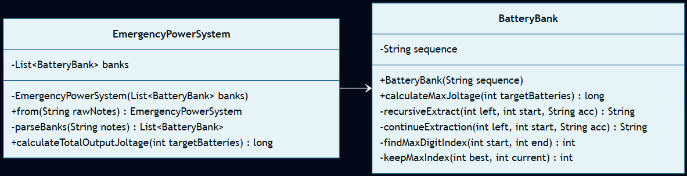

# Día 3: Lobby

## El Reto
### Parte A
Las escaleras mecánicas del vestíbulo están sin energía. Para encenderlas, debemos utilizar bancos de baterías de emergencia. Cada banco está representado por una secuencia de dígitos (del 1 al 9). El objetivo es extraer exactamente **2 baterías** (manteniendo su orden original de izquierda a derecha) para formar el número de dos dígitos más alto posible. La solución es la suma de los voltajes máximos de todos los bancos.

### Parte B
Las escaleras requieren aún más voltaje para superar la fricción estática, para ello debemos encender exactamente **12 baterías** de cada banco para formar un número de 12 dígitos. El objetivo vuelve a ser calcular la suma total final.

---

## Diagramas
*Diagrama de clases parte 1 y 2:*

## Lógica Estructural
* **`BatteryBank`**: [BatteryBank.java](./BatteryBank.java) - Encapsula la secuencia inmutable de texto de un banco individual. Su única responsabilidad es resolver su propio máximo matemático.
* **`EmergencyPowerSystem`**: [EmergencyPowerSystem.java](./EmergencyPowerSystem.java) - Lee el archivo de texto en bruto, lo limpia, instancia los bancos de baterías y actúa como agregador para calcular la suma final.

## Algoritmos
* **Algoritmo Voraz (Greedy):** Para alcanzar el máximo voltaje, se emplea una "Ventana Deslizante" restrictiva. El algoritmo selecciona iterativamente el dígito más alto disponible, garantizando que el espacio restante en la secuencia sea suficiente para extraer el número exacto de baterías requeridas en los turnos posteriores. (Ver [BatteryBank.java](./BatteryBank.java#L32-L38)).
* **Recursividad:** La extracción secuencial de baterías se modela como una función que se invoca a sí misma. Cada llamada transfiere el estado actualizado (baterías restantes, posición de búsqueda y acumulador) hasta alcanzar el caso base, evitando el uso de estados mutables. (Ver [BatteryBank.java](./BatteryBank.java#L21-L30)).

---

## Fundamentos
* **Abstracción** *(Simplificación de detalles complejos mediante interfaces o contratos claros)*: La clase [BatteryBank](./BatteryBank.java) expone el contrato público `calculateMaxJoltage`, abstrayendo por completo el complejo algoritmo voraz recursivo a sus clientes.
* **Modularidad** *(División del programa en módulos bien definidos e independientes)*: Se dividen con claridad las responsabilidades de parseo del fichero ([EmergencyPowerSystem](./EmergencyPowerSystem.java)) y de resolución matemática del banco ([BatteryBank](./BatteryBank.java)).
* **Alta Cohesión y Bajo Acoplamiento** *(Los módulos hacen una sola cosa y dependen mínimamente entre sí)*: Existe alta cohesión porque `BatteryBank` resuelve la matemática voraz y `EmergencyPowerSystem` orquesta el parseo y suma global. El acoplamiento es bajo porque el orquestador no interfiere ni conoce las variables temporales del proceso de selección de dígitos.
* **Código Expresivo** *(Código autoexplicativo, limpio y fácil de leer)*: Uso de flujos declarativos en `calculateTotalOutputJoltage` ([EmergencyPowerSystem.java](./EmergencyPowerSystem.java#L25-L29)) para realizar sumatorias limpias sobre los bancos de baterías.

## Principios de Diseño
* **SOLID**
    * **Single Responsibility Principle (SRP)** *(Una clase debe tener un único motivo para cambiar)*: `EmergencyPowerSystem` tiene la única responsabilidad de gestionar el agregado del sistema de energía, y `BatteryBank` se limita al algoritmo de un banco.
    * **Open/Closed Principle (OCP)** *(Abierto a la extensión, cerrado a la modificación)*: El diseño permite calibrar la cantidad de baterías que se desea extraer sin modificar el código interno del cálculo de selección en `BatteryBank`.
* **Law of Demeter (LoD) / Tell, Don't Ask** *(Evitar acoplamiento ordenando acciones en lugar de consultar estado interno)*: En [EmergencyPowerSystem.java](./EmergencyPowerSystem.java#L27) se invoca directamente al banco: `bank.calculateMaxJoltage(targetBatteries)` en lugar de recuperar su string y manipularlo externamente.
* **Keep It Simple, Stupid (KISS) & YAGNI** *(Simplicidad y no añadir código innecesario)*: Se resuelve mediante lógica recursiva pura e inmutable y sin requerir estructuras de almacenamiento complejas.

## Técnicas
* **Inmutabilidad del Modelo** *(Uso de estados que no cambian una vez creados)*: El banco de baterías es inmutable. Su secuencia (`private final String sequence`) es inalterable tras su construcción, garantizando consistencia.
* **Métodos Delegados** *(Dividir tareas complejas y delegar sub-operaciones)*: El método `recursiveExtract` ([BatteryBank.java](./BatteryBank.java#L22)) delega en `continueExtraction`, que a su vez delega el cálculo de índices a `findMaxDigitIndex`.
* **Inyección de Dependencias** *(Pasar colaboradores/datos en los parámetros de los métodos/constructores)*: El sistema `EmergencyPowerSystem` recibe su colección de bancos de baterías inyectada en el constructor.
* **Inversión del Control (IoC)** *(Delegar el control del flujo a un motor o framework externo)*: El control de la evaluación y filtrado de los bancos de energía se delega al motor de Streams mediante `.filter(...)`.
* **Fluent API** *(Encadenamiento de métodos para crear un flujo de lectura fluido)*: En [EmergencyPowerSystem.java](EmergencyPowerSystem.java) se utiliza una tubería encadenada (`banks.stream().mapToLong(bank -> bank.calculateMaxJoltage(targetBatteries)).sum()`) que se lee secuencialmente como: *"Toma todos los bancos, calcula el voltaje máximo de cada uno, y suma todos los voltajes"*.
* **Good Naming** *(Nombres descriptivos y precisos)*: Uso de nombres con alto valor conceptual de negocio como `calculateTotalOutputJoltage` e `findMaxDigitIndex`.

## Patrones de Diseño
* **Factory Method (Creacional)** *(Encapsulación de la creación de objetos en métodos estáticos dedicados)*: Tanto `BatteryBank.from(...)` ([BatteryBank.java](./BatteryBank.java#L13)) como `EmergencyPowerSystem.from(...)` ([EmergencyPowerSystem.java](./EmergencyPowerSystem.java#L14)) encapsulan la lógica de construcción de las entidades.

## Paradigmas
* **Orientación a Objetos** *(Organización del software en objetos que encapsulan estado y comportamiento)*: Destaca el uso de un fuerte **Encapsulamiento**, aislando toda la responsabilidad del cálculo de voltaje dentro del objeto `BatteryBank`.
* **Programación Funcional / Recursiva** *(Estilo declarativo basado en funciones puras y datos inmutables)*: Destaca el uso de sus pilares fundamentales: la **Inmutabilidad** (la secuencia original del banco de baterías nunca se altera) y el uso intensivo de **Funciones Puras** de forma recursiva para la búsqueda del dígito óptimo, evitando variables de estado mutables.

---

## Verificación y Tests
Las soluciones se validan de forma automática mediante pruebas unitarias escritas con JUnit 5 y AssertJ, estructuradas semánticamente siguiendo el patrón Given-When-Then (Dado un contexto, Cuando ocurre una acción, Entonces se espera un resultado). Esta estructura, heredada del enfoque BDD (Behavior-Driven Development), orienta los tests a comprobar el comportamiento del sistema maximizando su legibilidad.

* **Parte A:** [aTest.java](../../../../../../../../test/java/test/day03/aTest.java) - Verifica que se extraigan correctamente 2 baterías de cada banco para dar el mayor voltaje sumado posible (resultado esperado = `197`).
* **Parte B:** [bTest.java](../../../../../../../../test/java/test/day03/bTest.java) - Verifica la extracción de 12 baterías por banco para resolver el problema de la fricción estática.

