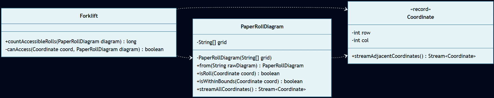
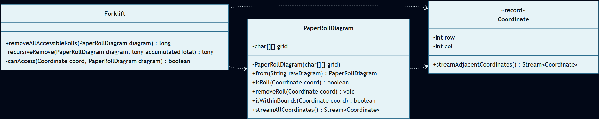

# Día 4: Printing Department

## El Reto
### Parte A
Analizar el plano bidimensional del departamento de impresión para ayudar a los elfos a localizar los rollos de papel (`@`). Una carretilla elevadora (*forklift*) solo puede acceder a un rollo si este tiene menos de 4 rollos adyacentes a su alrededor (considerando las 8 direcciones posibles). El objetivo es contar cuántos rollos son accesibles en el estado inicial de la fábrica.

### Parte B
Simular un proceso de limpieza en cadena. Al retirar los rollos accesibles, los rollos que estaban bloqueados en el interior pueden volverse accesibles en el siguiente turno. El objetivo es calcular el total histórico de rollos que las carretillas logran retirar, hasta que la fábrica se queda atascada y no se pueden sacar más.

---

## Diagramas
*Diagrama de clases parte 1:*

*Diagrama de clases parte 2:*

## Lógica Estructural
* **`Coordinate`**: [Coordinate.java](Coordinate.java) - Representa un punto en el espacio 2D y encapsula la lógica geométrica para generar un flujo (`Stream`) de sus propias coordenadas adyacentes.
* **`PaperRollDiagram (A)`**: [PaperRollDiagram.java](./a/PaperRollDiagram.java) - Representación inmutable del mapa. Actúa exclusivamente como entorno de datos de solo lectura, procesando el array de texto y exponiendo métodos de consulta.
* **`PaperRollDiagram (B)`**: [PaperRollDiagram.java](./b/PaperRollDiagram.java) - Representación mutable del mapa. Actúa como el entorno, utilizando una matriz interna de caracteres para permitir consultas y la alteración del estado local (`removeRoll`).
* **`Forklift (A y B)`**: [Forklift.java (A)](./a/Forklift.java) y [Forklift.java (B)](./b/Forklift.java) - Contienen la lógica de negocio y las reglas de extracción. Reciben un mapa y evalúan su densidad espacial.

## Algoritmos
* **Recursividad:** El proceso de limpieza se ejecuta mediante una función recursiva en el montacargas (`recursiveRemove`). En cada ciclo, el algoritmo identifica los rollos disponibles consultando al diagrama, los elimina invocando `diagram.removeRoll()`, y se invoca a sí mismo con el nuevo estado acumulado hasta alcanzar el caso base (sin rollos accesibles). (Ver [Forklift.java (B)](./b/Forklift.java)).
* **Escaneo de Vecindad (Moore Neighborhood):** Algoritmo de detección espacial que calcula la densidad de rollos en las 8 direcciones adyacentes, aplicando restricciones de límites para evitar excepciones de acceso a memoria fuera de rango ([Coordinate.java](./Coordinate.java)).

---

## Fundamentos
* **Abstracción** *(Simplificación de detalles complejos mediante interfaces o contratos claros)*: La clase [Coordinate](Coordinate.java) abstrae la complejidad de la geometría en 2D, exponiendo contratos limpios para acceder a adyacencias sin revelar sus cálculos internos a los clientes.
* **Modularidad** *(División del programa en módulos bien definidos e independientes)*: Se aísla por completo la geometría espacial ([Coordinate](Coordinate.java)), el modelo de datos del entorno ([PaperRollDiagram](./a/PaperRollDiagram.java)) y las reglas de negocio y actuación ([Forklift](./a/Forklift.java)).
* **Alta Cohesión y Bajo Acoplamiento** *(Los módulos hacen una sola cosa y dependen mínimamente entre sí)*: Existe alta cohesión gracias a una estricta separación de responsabilidades: `Coordinate` solo maneja cálculos geométricos, `PaperRollDiagram` gestiona exclusivamente el almacenamiento y límites del terreno, y `Forklift` evalúa las reglas del montacargas. El acoplamiento es bajo porque el mapa y la geometría ignoran por completo qué actores operan sobre ellos (ej: no saben qué es un "Forklift").
* **Código Expresivo** *(Código autoexplicativo, limpio y fácil de leer)*: El pipeline funcional en el método `canAccess` de la clase Forklift (`streamAdjacentCoordinates().filter(diagram::isWithinBounds).filter(diagram::isRoll).count() < 4`) se lee casi como lenguaje natural: *"Genera un flujo de mis coordenadas adyacentes, quédate solo con las que estén dentro de los límites del mapa, luego filtra solo las que contengan un rollo de papel, cuéntalas y devuélveme 'verdadero' si hay menos de 4"*.

## Principios de Diseño
* **SOLID**
    * **Single Responsibility Principle (SRP)** *(Una clase debe tener un único motivo para cambiar)*: Hemos dividido el diseño para que el entorno (`PaperRollDiagram`) cambie solo si lo hace el formato de la cuadrícula, la geometría (`Coordinate`) si cambian las matemáticas espaciales, y el actor (`Forklift`) si cambian las reglas de acceso.
    * **Open/Closed Principle (OCP)** *(Abierto a la extensión, cerrado a la modificación)*: En lugar de modificar el diagrama original de la parte A para acomodar la lógica compleja de la parte B llenándolo de sentencias `if`, se crea una nueva implementación `PaperRollDiagram` (B), manteniendo el código original cerrado a alteraciones.
* **Don't Repeat Yourself (DRY)** *(Evitar la duplicación de lógica)*: El modelo geométrico [Coordinate](Coordinate.java) se comparte tanto por el diagrama de lectura de la Parte A como por el de simulación de la Parte B.
* **Law of Demeter (LoD)** *(Evitar acoplamiento ordenando acciones en lugar de consultar estado interno)*: En la simulación (Parte B), el actor `Forklift` ordena activamente al diagrama alterar su estado mediante un contrato (`diagram.removeRoll()`) en lugar de intentar obtener la matriz interna de caracteres para mutarla externamente.
* **Keep It Simple, Stupid (KISS) & You Aren't Gonna Need It (YAGNI)** *(Simplicidad y no añadir código innecesario)*: Hemos evitado deliberadamente añadir abstracciones innecesarias o prematuras (como interfaces genéricas para el mapa o el montacargas) y evitado implementar motores de pathfinding complejos, optando por clases directas y un filtrado funcional simple sobre el `Stream` que resuelve el problema a la perfección.

## Técnicas
* **Inmutabilidad del Modelo** *(Uso de estados que no cambian una vez creados)*: [Coordinate](Coordinate.java) es un `record` de Java, impidiendo mutar sus coordenadas una vez instanciado.
* **Métodos Delegados** *(Dividir tareas complejas y delegar sub-operaciones)*: El conteo de rollos accesibles en [Forklift (A)](./a/Forklift.java) delega inteligentemente sus filtros a los predicados expuestos por el entorno (`diagram::isRoll`).
* **Inyección de Dependencias** *(Pasar colaboradores/datos en los parámetros de los métodos/constructores)*: El actor `Forklift` recibe inyectado en su constructor el `PaperRollDiagram` sobre el que debe operar, desacoplándolo de la creación algorítmica del mapa.
* **Inversión del Control (IoC)** *(Delegar el control del flujo a un motor o framework externo)*: Al utilizar `streamAllCoordinates().flatMap(...)`, el flujo de iteración bidimensional se delega internamente a la API de Streams.
* **Fluent API** *(Encadenamiento de métodos para crear un flujo de lectura fluido)*: En [Forklift (A)](a/Forklift.java) se utiliza una tubería encadenada (`diagram.streamAllCoordinates().filter(diagram::isRoll).filter(coord -> this.canAccess(coord, diagram)).count()`) que se lee de forma natural como: *"Genera todas las coordenadas, filtra las que son un rollo de papel, filtra las que son accesibles por el montacargas, y cuéntalas"*.
* **Good Naming** *(Nombres descriptivos y precisos)*: Nombres claros como `streamAdjacentCoordinates`, `isAccessibleByForklift` e `isWithinBounds`.

## Patrones de Diseño
* **Factory Method (Creacional)** *(Encapsulación de la creación de objetos en métodos estáticos dedicados)*: Las clases `PaperRollDiagram` utilizan el método estático `from(String rawDiagram)` para aislar el parseo del texto y la conversión a arreglos de caracteres. (Ver [PaperRollDiagram.java (A)](./a/PaperRollDiagram.java#L15-L17)).

## Paradigmas
* **Orientación a Objetos** *(Organización del software en objetos que encapsulan estado y comportamiento)*: Destaca el uso de un fuerte **Encapsulamiento** y **Abstracción**, donde cada concepto del problema tiene su propia representación: la geometría (`Coordinate`), el entorno espacial (`PaperRollDiagram`) y los actores operacionales (`Forklift`), aislando su propio estado y comportamiento.
* **Programación Funcional** *(Estilo declarativo basado en funciones puras y datos inmutables)*: Destaca el uso de sus pilares fundamentales: la **Inmutabilidad** de los datos (el `record` geométrico `Coordinate` nunca muta su posición) y el **Estilo Declarativo** mediante Streams (`filter`, `count`) en `Forklift` para procesar las celdas de forma matemática pura.

---

## Verificación y Tests
Las soluciones se validan de forma automática mediante pruebas unitarias escritas con JUnit 5 y AssertJ, estructuradas semánticamente siguiendo el patrón Given-When-Then (Dado un contexto, Cuando ocurre una acción, Entonces se espera un resultado). Esta estructura, heredada del enfoque BDD (Behavior-Driven Development), orienta los tests a comprobar el comportamiento del sistema maximizando su legibilidad.

* **Parte A:** [aTest.java](../../../../../../test/java/test/day04/aTest.java) - Valida que se cuenten correctamente los rollos accesibles iniciales en el mapa de prueba (resultado esperado = `5`).
* **Parte B:** [bTest.java](../../../../../../test/java/test/day04/bTest.java) - Simula la extracción recursiva en cascada y valida que el total histórico de rollos retirados coincida con la especificación (resultado esperado = `12`).

