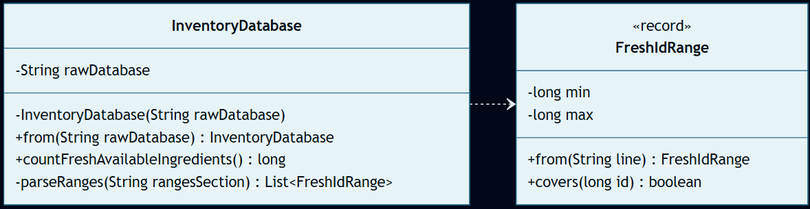
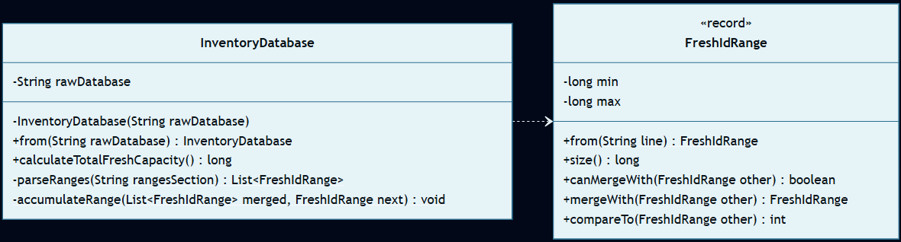

# Día 5: Cafeteria

## El Reto
### Parte A
Los elfos han implementado un nuevo sistema de inventario en la cafetería. La base de datos exporta dos bloques de texto: una lista de rangos inclusivos que definen qué IDs de ingredientes están frescos (ej. `3-5`), y una lista de IDs de ingredientes físicos actualmente disponibles. El objetivo es cruzar los datos y calcular cuántos de los ingredientes disponibles caen dentro de algún rango de frescura.

### Parte B
La lista de ingredientes disponibles se descarta por ser irrelevante. Ahora, el objetivo es calcular la capacidad matemática total del inventario: cuántos IDs únicos en total abarcan los rangos de frescura. Dado que los rangos pueden solaparse espacialmente o ser continuos, se fusionan antes de calcular el recuento total para evitar duplicidades.

---

## Diagramas
*Diagrama de clases parte 1:*

*Diagrama de clases parte 2:*

## Lógica Estructural
* **`InventoryDatabase`**: (Parte A: [InventoryDatabase.java](a/InventoryDatabase.java) / Parte B: [InventoryDatabase.java](b/InventoryDatabase.java)) - Centraliza el parseo del texto y expone dos vías de resolución independientes para responder a las dos preguntas de negocio sin duplicar el estado en memoria.
* **`FreshIdRange`**: (Parte A: [FreshIdRange.java](a/FreshIdRange.java) / Parte B: [FreshIdRange.java](b/FreshIdRange.java)) - Entidad inmutable del dominio (`record`). No es un simple contenedor de datos, sino que posee la inteligencia espacial para calcular su propio tamaño (`size()`), detectar colisiones limítrofes (`canMergeWith()`) y generar nuevas instancias fusionadas (`mergeWith()`).

---

## Fundamentos
* **Abstracción** *(Simplificación de detalles complejos mediante interfaces o contratos claros)*: `FreshIdRange` expone métodos públicos claros (`covers`, `mergeWith`) que esconden a los clientes los complejos detalles algebraicos de la unión de intervalos.
* **Modularidad** *(División del programa en módulos bien definidos e independientes)*: División clara entre el procesador agregador del inventario (`InventoryDatabase`) y la entidad matemática de rangos (`FreshIdRange`).
* **Alta Cohesión y Bajo Acoplamiento** *(Los módulos hacen una sola cosa y dependen mínimamente entre sí)*: Existe alta cohesión porque `FreshIdRange` solo contiene la lógica matemática de intervalos e `InventoryDatabase` orquesta su procesamiento. El acoplamiento es bajo porque el modelo numérico ignora cómo se almacenan o extraen del fichero de inventario.

## Principios de Diseño
* **SOLID**
    * **Single Responsibility Principle (SRP)** *(Una clase debe tener un único motivo para cambiar)*: `FreshIdRange` maneja únicamente intervalos matemáticos e `InventoryDatabase` orquesta el parseo del texto para obtener datos para la resolución de la lógica de negocio.
    * **Open/Closed Principle (OCP)** *(Abierto a la extensión, cerrado a la modificación)*: Si se añaden nuevos criterios de frescura, `InventoryDatabase` no cambia, simplemente se añaden operaciones sobre la entidad de dominio `FreshIdRange`.
* **Don't Repeat Yourself (DRY)** *(Evitar la duplicación de lógica)*: El parseo numérico de rangos a partir de strings planos se centraliza en el método `from` de la clase `FreshIdRange`.

## Técnicas
* **Inmutabilidad del Modelo** *(Uso de estados que no cambian una vez creados)*: `FreshIdRange` es un `record`. Su fusión no modifica sus límites internos, sino que devuelve una nueva instancia inmutable `FreshIdRange`. (Ver [FreshIdRange.java (B)](b/FreshIdRange.java)).
* **Métodos Delegados** *(Dividir tareas complejas y delegar sub-operaciones)*: `calculateTotalFreshCapacity` en [InventoryDatabase (B)](b/InventoryDatabase.java) delega el proceso de fusión en la función estática `accumulateRange`.
* **Inversión del Control (IoC)** *(Delegar el control del flujo a un motor o framework externo)*: El motor de reducción de Java se hace cargo del flujo de acumulación de los rangos al llamar a `collect(...)` de la API de Streams. (Ver [InventoryDatabase.java (B)](b/InventoryDatabase.java)).
* **Good Naming** *(Nombres descriptivos y precisos)*: Nombres de negocio expresivos como `canMergeWith` o `calculateTotalFreshCapacity`.

## Patrones de Diseño
* **Factory Method (Creacional)** *(Encapsulación de la creación de objetos en métodos estáticos dedicados)*: Las factorías estáticas `FreshIdRange.from(...)` e `InventoryDatabase.from(...)` encapsulan de forma segura la creación de objetos validados a partir de entradas de texto crudo.

## Paradigmas
* **Orientación a Objetos** *(Organización del software en objetos que encapsulan estado y comportamiento)*: Se encapsula el comportamiento matemático del intervalo en el objeto rico `FreshIdRange` en lugar de tratarlo como una tupla inerte de enteros.
* **Programación Funcional** *(Estilo declarativo basado en funciones puras y datos inmutables)*: Se sustenta en dos grandes pilares funcionales: el uso de entidades inmutables (el `record` `FreshIdRange` nunca muta al fusionarse, sino que devuelve una copia nueva) y el diseño declarativo mediante Streams (`sorted`, `mapToLong`, `sum`) para calcular la capacidad sin usar variables de estado acumulativas.

---

## Verificación y Tests
Las soluciones se validan de forma automática mediante pruebas unitarias escritas con JUnit 5 y AssertJ, estructuradas semánticamente siguiendo el patrón Given-When-Then (Dado un contexto, Cuando ocurre una acción, Entonces se espera un resultado). Esta estructura, heredada del enfoque BDD (Behavior-Driven Development), orienta los tests a comprobar el comportamiento del sistema maximizando su legibilidad.

* **Parte A:** [aTest.java](../../../../../../test/java/test/day05/aTest.java) - Verifica que se cuenten correctamente los ingredientes disponibles que están contenidos dentro de los rangos de frescura (resultado esperado = `4`).
* **Parte B:** [bTest.java](../../../../../../test/java/test/day05/bTest.java) - Verifica la capacidad total del inventario tras la fusión de los rangos solapados y contiguos (resultado esperado = `14`).

