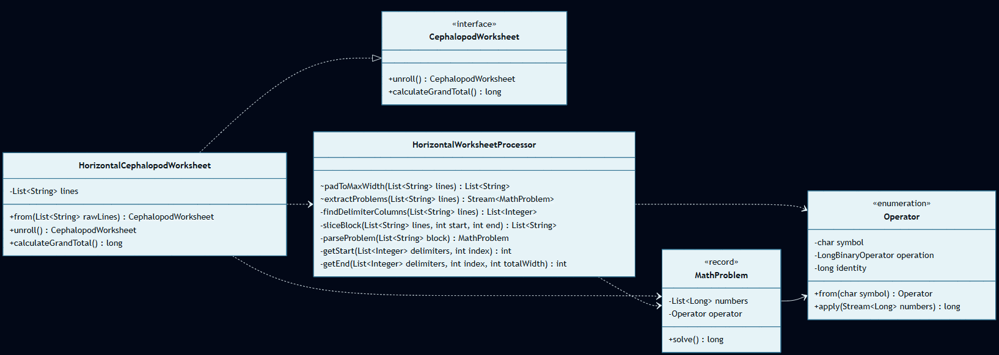
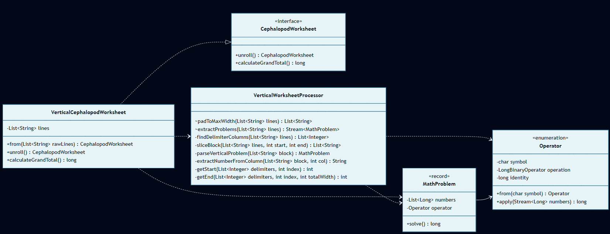

# Día 6: Trash Compactor

## El Reto
### Parte A
Procesar y resolver una hoja de cálculo donde los números y operadores están distribuidos en bloques delimitados por columnas vacías. La lectura de los números se realiza de izquierda a derecha y la última fila indica la operación matemática a aplicar al bloque. El objetivo es calcular el "Grand Total" sumando los resultados de todas las operaciones.

### Parte B
Interpretar la misma hoja de cálculo aplicando el sistema de lectura nativo de los cefalópodos: el texto se lee verticalmente. Las columnas, leídas de derecha a izquierda dentro de cada bloque, forman los números reales. El objetivo es recalcular el "Grand Total" bajo este nuevo paradigma espacial.

---

## Diagramas
*Diagrama de clases parte 1:*

*Diagrama de clases parte 2:*

## Lógica Estructural
* **`CephalopodWorksheet`**: [`CephalopodWorksheet`](CephalopodWorksheet.java) - Interfaz genérica. Define el contrato fluido que cualquier paradigma de lectura (horizontal o vertical) debe cumplir para ser procesado (`unroll` y `calculateGrandTotal`).
* **`Operator`**: [`Operator`](Operator.java) - Motor matemático basado en un `enum`. Asocia los símbolos de texto (`+`, `*`) con sus funciones matemáticas reales y sus elementos "identity" para ser aplicadas sobre colecciones de números.
* **`MathProblem`**: [`MathProblem`](MathProblem.java) - Entidad inmutable (`record`) del dominio. Encapsula un bloque matemático ya traducido (lista de operandos y su operador) y contiene la lógica para resolverse a sí mismo.
* **`HorizontalCephalopodWorksheet` / `VerticalCephalopodWorksheet`**: ([`HorizontalCephalopodWorksheet`](a/HorizontalCephalopodWorksheet.java) / [`VerticalCephalopodWorksheet`](b/VerticalCephalopodWorksheet.java)) - Su única función es proporcionar un punto de entrada limpio, coordinar el flujo y delegar el trabajo complejo al procesador correspondiente.
* **`HorizontalWorksheetProcessor` / `VerticalWorksheetProcessor`**: ([`HorizontalWorksheetProcessor`](a/HorizontalWorksheetProcessor.java) / [`VerticalWorksheetProcessor`](b/VerticalWorksheetProcessor.java)) - Manipulan las cadenas de texto, detectan las columnas vacías, aíslan los bloques espaciales y traducen el texto en bruto a instancias del dominio `MathProblem`.

---

## Fundamentos
* **Abstracción** *(Simplificación de detalles complejos mediante interfaces o contratos claros)*: La interfaz [`CephalopodWorksheet`](CephalopodWorksheet.java) expone métodos abstractos para el desenrollado, escondiendo internamente los complejos detalles de escaneo bidimensional de texto a los clientes.
* **Modularidad** *(División del programa en módulos bien definidos e independientes)*: Separación entre el dominio matemático ([`MathProblem`](MathProblem.java), [`Operator`](Operator.java)) y los algoritmos de escaneo espacial.
* **Alta Cohesión y Bajo Acoplamiento** *(Los módulos hacen una sola cosa y dependen mínimamente entre sí)*: Existe alta cohesión porque `Operator`/`MathProblem` resuelven la matemática pura y los procesadores (`HorizontalWorksheetProcessor`) orquestan el escaneo espacial. El acoplamiento es bajo por dos motivos: el motor matemático desconoce la estructura de texto de la que provienen los datos, y el código cliente consume una interfaz abstracta (`CephalopodWorksheet`), ignorando por completo si el archivo se escaneó horizontal o verticalmente.
* **Código Expresivo (Clean Code)** *(Código autodocumentado que se lee como lenguaje natural)*: Nombres altamente descriptivos como `unroll` y `calculateGrandTotal` que explican de un vistazo la operación que se realiza sobre la hoja de cálculo.

## Principios de Diseño
* **SOLID**
    * **Single Responsibility Principle (SRP)** *(Una clase debe tener un único motivo para cambiar)*: Los procesadores (como `HorizontalWorksheetProcessor`) solo parsean texto espacial. `MathProblem` solo resuelve la ecuación.
    * **Open/Closed Principle (OCP)** *(Abierto a la extensión, cerrado a la modificación)*: Para añadir un nuevo tipo de lectura (ej. diagonal), basta con crear un nuevo procesador e implementar la interfaz `CephalopodWorksheet` sin modificar el motor matemático de `Operator`.
    * **Liskov Substitution Principle (LSP)** *(Los subtipos deben ser sustituibles por sus tipos base)*: Cualquier implementación (`HorizontalCephalopodWorksheet` o `VerticalCephalopodWorksheet`) puede sustituir a la interfaz `CephalopodWorksheet` sin romper la corrección del flujo del programa.
    * **Interface Segregation Principle (ISP)** *(Ningún cliente debe ser forzado a depender de métodos que no usa)*: La interfaz `CephalopodWorksheet` es extremadamente pequeña y enfocada al consumidor final, exponiendo solo dos métodos (`unroll()` y `calculateGrandTotal()`) sin obligar al cliente a depender de la compleja lógica de escaneo interno.
    * **Dependency Inversion Principle (DIP)** *(Depender de abstracciones, no de clases concretas)*: El flujo principal opera sobre [`CephalopodWorksheet`](CephalopodWorksheet.java) desacoplándose del paradigma de orientación de lectura.
* **Don't Repeat Yourself (DRY)** *(Evitar la duplicación de lógica)*: La lógica de resolución de las ecuaciones matemáticas (`MathProblem` y `Operator`) es completamente agnóstica a la orientación espacial y se reutiliza al 100% en ambas partes.
* **Law of Demeter (LoD)** *(Evitar acoplamiento ordenando acciones en lugar de consultar estado interno)*: Se le pide al objeto `MathProblem` que se resuelva a sí mismo invocando `problem.solve()`, en lugar de extraer su operador y operandos para calcularlo desde fuera.
* **Keep It Simple, Stupid (KISS) & You Aren't Gonna Need It (YAGNI)** *(Simplicidad y no añadir código innecesario)*: En lugar de crear complejas jerarquías de clases (ej. `AddStrategy`, `MultiplyStrategy`), se implementa el patrón Strategy utilizando lambdas funcionales nativas (`LongBinaryOperator`) dentro de un sencillo `enum`.

## Técnicas
* **Inmutabilidad del Modelo** *(Uso de estados que no cambian una vez creados)*: `MathProblem` es un `record` inmutable de Java.
* **Métodos Delegados** *(Dividir tareas complejas y delegar sub-operaciones)*: `MathProblem.solve` ([`MathProblem`](MathProblem.java)) delega la resolución a la función del operador: `operator.apply(...)`.
* **Inyección de Dependencias** *(Pasar colaboradores/datos en los parámetros de los métodos/constructores)*: `apply` en `Operator` recibe el `Stream<Long>` de números para operar. (Ver [`Operator`](Operator.java)).
* **Inversión del Control (IoC)** *(Delegar el control del flujo a un motor o framework externo)*: El flujo principal de escaneo de columnas espaciales y la sumatoria delegada a `Operator` ocurre dentro de `.filter(...).mapToLong(...).sum()`.
* **Fluent API** *(Encadenamiento de métodos para crear un flujo de lectura fluido)*: En [`VerticalWorksheetProcessor`](b/VerticalWorksheetProcessor.java) se utiliza un encadenamiento fluido (`lines.stream().mapToInt(String::length).max().orElse(0)`) que se traduce a lenguaje natural como: *"Toma todas las líneas de texto, extrae la longitud de cada una, y devuelve la máxima (o 0 si no hay)"*.
* **Good Naming** *(Nombres descriptivos y precisos)*: Nombres precisos como `solve`, `apply` y `parseBlock`.

## Patrones de Diseño
* **Factory Method (Creacional)** *(Encapsulación de la creación de objetos en métodos estáticos dedicados)*: Métodos estáticos como `HorizontalCephalopodWorksheet.from(...)` y `Operator.from(char symbol)` aíslan y normalizan la creación.
* **Strategy (Comportacional)** *(Encapsular algoritmos intercambiables)*: El enum [`Operator`](Operator.java) encapsula la estrategia matemática correspondiente (`ADD`, `MULTIPLY`) mediante lambdas funcionales de tipo `LongBinaryOperator`.

## Paradigmas
* **Orientación a Objetos** *(Organización del software en objetos que encapsulan estado y comportamiento)*: Destaca el uso del **Polimorfismo** mediante la interfaz `CephalopodWorksheet`, y un **Encapsulamiento** y **Abstracción** en la entidad `MathProblem`, la cual aísla internamente sus datos (números y operador) y expone un único comportamiento público (`solve()`), abstrayendo al cliente de la complejidad del cálculo interno.
* **Programación Funcional** *(Estilo declarativo basado en funciones puras y datos inmutables)*: Destaca el uso de sus pilares fundamentales: las **Funciones de 1ª Clase** (usando lambdas `LongBinaryOperator` para inyectar comportamiento puramente matemático) y el **Estilo Declarativo** de sus *pipelines* (`map`, `filter`, `reduce`) que procesan los datos sin alterar variables de estado.

---

## Verificación y Tests
Las soluciones se validan de forma automática mediante pruebas unitarias escritas con JUnit 5 y AssertJ, estructuradas semánticamente siguiendo el patrón Given-When-Then (Dado un contexto, Cuando ocurre una acción, Entonces se espera un resultado). Esta estructura, heredada del enfoque BDD (Behavior-Driven Development), orienta los tests a comprobar el comportamiento del sistema maximizando su legibilidad.

* **Parte A:** [`aTest`](../../../../../../test/java/test/day06/aTest.java) - Verifica la correcta resolución horizontal y suma de bloques del total general (resultado esperado = `562`).
* **Parte B:** [`bTest`](../../../../../../test/java/test/day06/bTest.java) - Valida el escaneo vertical y la lógica de lectura nativa de los cefalópodos para la sumatoria (resultado esperado = `612`).

