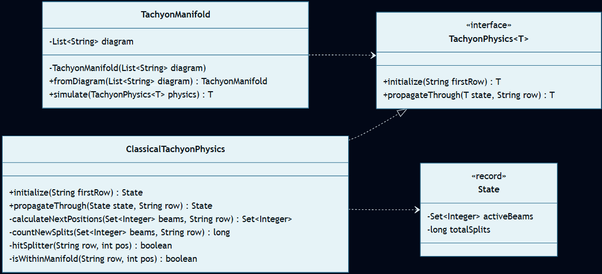
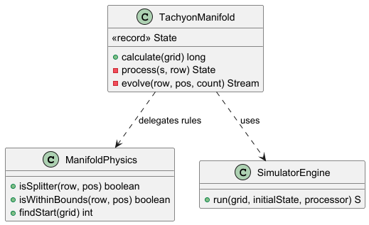

# Día 7: Laboratories

## El Reto
### Parte A
Simular el recorrido de un rayo de taquiones cayendo a través de un colector. El rayo se divide en dos cada vez que choca contra un divisor (`^`). El objetivo es calcular cuántas divisiones se producen en total.

### Parte B
Aplicar la interpretación de los "muchos mundos" a una sola partícula cuántica. Cada choque no divide el rayo físico, sino que bifurca la realidad creando líneas temporales paralelas. El objetivo es calcular cuántos universos paralelos (líneas temporales únicas) existen al finalizar el recorrido.

---

## Diagramas
*Diagrama de clases parte 1:*

*Diagrama de clases parte 2:*

## Lógica Estructural
* **`TachyonManifold`**: Almacena el diagrama de texto original de forma inmutable, lo recorre fila por fila de arriba a abajo y delega los cálculos a la física inyectada.
* **`TachyonPhysics<SimulationState>`**: Interfaz genérica. Define el contrato estricto que cualquier ley física del universo debe cumplir (`initialize` y `propagateThrough`).
* **`ClassicalTachyonPhysics`**: Implementación de las reglas de la Parte A. Gestiona divisiones simples y coordenadas únicas.
* **`ClassicalTachyonPhysics.State`**: Entidad inmutable (`record`) que encapsula el estado clásico: las posiciones actuales del rayo (`Set<Integer>`) y el contador global de choques.
* **`QuantumTachyonPhysics`**: Implementación de las reglas de la Parte B. Gestiona la bifurcación exponencial de las líneas temporales.
* **`QuantumTachyonPhysics.State`**: Entidad inmutable (`record`) que encapsula el estado cuántico: un diccionario (`Map<Integer, Long>`) que relaciona cada coordenada con la cantidad de universos paralelos que la atraviesan.

## Algoritmos
* **Programación Dinámica:** En lugar de simular millones de rayos individuales (fuerza bruta exponencial), se utiliza un `Map<Integer, Long>` para agrupar líneas temporales que convergen en la misma coordenada. Esto transforma una complejidad exponencial en un cálculo lineal mediante sumatorias acumulativas.

## Técnicas de Implementación
* **Polimorfismo Paramétrico (Genéricos):** Uso de `<T>` en la interfaz de física para permitir que el estado de la simulación sea flexible (`Set` vs `Map`), garantizando seguridad de tipos sin recurrir a casteos manuales.
* **Inmutabilidad del Modelo:** En cada paso de la simulación, no se modifica la matriz existente; se genera un objeto `State` totalmente nuevo. Esto garantiza hilos de ejecución limpios.

## Patrones de Diseño
* **Patrón Factory Method (Creacional):** La lógica de instanciación de `TachyonManifold` queda oculta tras el método estático `fromDiagram()`. Esto garantiza que la entidad siempre se construya con una lista inmutable, protegiendo al sistema de modificaciones externas.

## Principios de Diseño
### SOLID
* **Principio de Abierto/Cerrado (OCP):** El motor de simulación está diseñado para ser extendido. Si en el futuro surgiera una "Física Cuántica Avanzada", basta con crear una nueva implementación de `TachyonPhysics`.
* **Principio de Responsabilidad Única (SRP):** Existe una separación estricta entre la física del dominio (`TachyonPhysics`), la lógica de recorrido del mapa (`TachyonManifold`) y la gestión de la entrada de datos (`Main`).