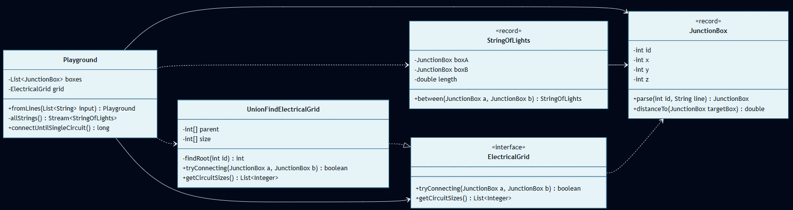
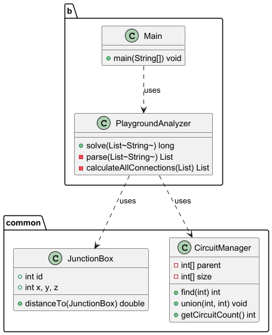

# Día 8: Playground

## El Reto
### Parte A
Conectar las cajas más cercanas usando la menor cantidad de cable posible, agrupándolas y calculando el tamaño de las redes resultantes.

### Parte B
Continuar conectando los grupos aislados hasta lograr que todas las cajas formen parte de un único y gran circuito eléctrico continuo.

---

## Diagramas
*Diagrama de clases parte 1:*

*Diagrama de clases parte 2:*

## Lógica Estructural
* **`Playground`**: (Parte A: [`Playground`](a/Playground.java) / Parte B: [`Playground`](b/Playground.java)) - Toma las decisiones de conexión basándose en las longitudes de los cables y dirige el flujo de ejecución.
* **`ElectricalGrid`**: [`ElectricalGrid`](ElectricalGrid.java) - Interfaz matemática abstracta. Define el contrato estricto para fusionar circuitos y obtener sus tamaños.
* **`UnionFindElectricalGrid`**: [`UnionFindElectricalGrid`](UnionFindElectricalGrid.java) - Implementación concreta de la red eléctrica. Responsable de la lógica matemática subyacente para agrupar redes eficientemente (mediante la estructura de datos *Disjoint-Set*).
* **`StringOfLights`**: [`StringOfLights`](StringOfLights.java) - Entidad inmutable (`record`) portadora de datos que relaciona dos cajas y conoce la distancia que las separa.
* **`JunctionBox`**: [`JunctionBox`](JunctionBox.java) - Entidad inmutable (`record`) del dominio físico que conoce su ubicación espacial en 3D y calcula distancias geométricas.

## Algoritmos
* **Algoritmo de Kruskal (Árbol de Expansión Mínima - MST):** Enfoque codicioso (*Greedy*) que conecta todos los puntos del mapa usando la menor cantidad de cable posible. Selecciona iterativamente los cables más cortos y consulta a la red si las cajas ya están conectadas, descartando aquellos que generen ciclos cerrados (cortocircuitos inútiles) hasta formar un único circuito continuo. (Ver [`Playground.java (B)`](b/Playground.java)).
* **Disjoint-Set (Union-Find):** Estructura de datos avanzada implementada para soportar a Kruskal. Permite agrupar las cajas eléctricas en conjuntos disjuntos (grupos cerrados que no tienen elementos en común entre sí) y resolver si dos cajas ya pertenecen a la misma red, optimizando la detección de cortocircuitos mediante un atajo en memoria que guarda el camino más rápido al nodo principal. (Ver [`UnionFindElectricalGrid`](UnionFindElectricalGrid.java)).

---

## Fundamentos
* **Abstracción** *(Simplificación de detalles complejos mediante interfaces o contratos claros)*: La interfaz [`ElectricalGrid`](ElectricalGrid.java) funciona como un panel de control muy sencillo (`tryConnecting`, `getCircuitSizes`). Gracias a ella, la clase `Playground` puede dar la orden de conectar luces sin tener que lidiar ni preocuparse por los complejos algoritmos matemáticos (*Union-Find*) que ocurren por detrás.
* **Modularidad** *(División del programa en módulos bien definidos e independientes)*: Claro aislamiento de responsabilidades entre el modelo físico (`JunctionBox` y `StringOfLights`), la estructura del grafo (`UnionFindElectricalGrid`) y el gestor de negocio (`Playground`).
* **Alta Cohesión y Bajo Acoplamiento** *(Los módulos hacen una sola cosa y dependen mínimamente entre sí)*: Existe alta cohesión porque `UnionFindElectricalGrid` resuelve los conjuntos disjuntos y `Playground` orquesta la construcción de la red. El acoplamiento es bajo porque el motor matemático de grafos desconoce por completo que está interconectando luces en un espacio físico tridimensional.
* **Código Expresivo (Clean Code)** *(Código autodocumentado que se lee como lenguaje natural)*: Uso de términos claros como `connectShortestStrings`, `JunctionBox` y `UnionFindElectricalGrid` que explican el comportamiento de las clases sin necesidad de añadir comentarios.

## Principios de Diseño
* **SOLID**
    * **Single Responsibility Principle (SRP)** *(Una clase debe tener un único motivo para cambiar)*: `JunctionBox` maneja geometría, `StringOfLights` representa cables de luz, `UnionFindElectricalGrid` gestiona la conectividad del grafo y `Playground` dirige el flujo de ensamblado global.
    * **Open/Closed Principle (OCP)** *(Abierto a la extensión, cerrado a la modificación)*: El ensamblador `Playground` interactúa de forma abstracta con una `ElectricalGrid`. Esto permite que el sistema se pueda extender en el futuro cambiando a cualquier otro algoritmo matemático sin necesidad de modificar el código de `Playground`.
    * **Dependency Inversion Principle (DIP)** *(Depender de abstracciones, no de clases concretas)*: `Playground` depende de la interfaz [`ElectricalGrid`](ElectricalGrid.java) y no directamente de `UnionFindElectricalGrid`.
    * **Interface Segregation Principle (ISP)** *(Ningún cliente debe ser forzado a depender de métodos que no usa)*: La interfaz `ElectricalGrid` es muy limpia, declarando únicamente `tryConnecting` y `getCircuitSizes`.
* **Law of Demeter (LoD)** *(Evitar acoplamiento ordenando acciones en lugar de consultar estado interno)*: En [`StringOfLights`](StringOfLights.java) el cable se autoinicializa pidiéndole a la caja `a` calcular la distancia a `b` (`a.distanceTo(b)`) en lugar de extraer sus componentes numéricos cartesianos.

## Técnicas
* **Inmutabilidad del Modelo** *(Uso de estados que no cambian una vez creados)*: `JunctionBox` y `StringOfLights` son `record` inmutables, impidiendo alterar coordenadas físicas o nodos conectados una vez definidos.
* **Inyección de Dependencias** *(Pasar colaboradores/datos en los parámetros de los métodos/constructores)*: La lista de cajas de conexión (`List<JunctionBox>`) se inyecta en el constructor de `Playground`, desligando a la clase del parseo de las cajas.
* **Inversión del Control (IoC)** *(Delegar el control del flujo a un motor o framework externo)*: En `allStrings()`, el proceso combinatorio iterativo se delega completamente a la API de Streams mediante `IntStream.range().flatMap(...)`.
* **Fluent API** *(Encadenamiento de métodos para crear un flujo de lectura fluido)*: En [`Main.java (A)`](a/Main.java) los métodos de `Playground` devuelven `this` para permitir un flujo de negocio extremadamente corto y expresivo (`Playground.fromLines(input).connectShortestStrings(1000).productOfLargestCircuits(3)`) que se lee como: *"Inicia el mapa desde el texto, conecta los 1000 cables más cortos, y dame el producto de los 3 circuitos más grandes"*.
* **Good Naming** *(Nombres descriptivos y precisos)*: Términos claros como `tryConnecting`, `getCircuitSizes` y `distanceTo`.

## Patrones de Diseño
* **Factory Method (Creacional)** *(Encapsulación de la creación de objetos en métodos estáticos dedicados)*: Factorías semánticas estáticas como `JunctionBox.parse(...)`, `StringOfLights.between(...)` y `Playground.fromLines(...)` encapsulan de forma segura la creación de objetos.

## Paradigmas
* **Orientación a Objetos** *(Organización del software en objetos que encapsulan estado y comportamiento)*: Destaca el uso de tres de los cuatro pilares fundamentales: la **Abstracción** y el **Polimorfismo** a través de la interfaz `ElectricalGrid` (permitiendo que `Playground` opere contra un contrato genérico y no contra una clase), y un fuerte **Encapsulamiento** (aislando el estado de los arrays matemáticos internamente dentro de `UnionFindElectricalGrid`).
* **Programación Funcional** *(Estilo declarativo basado en funciones puras y datos inmutables)*: Destaca el uso de sus pilares fundamentales: la absoluta **Inmutabilidad** de las estructuras mediante `records` de Java (`JunctionBox`, `StringOfLights`), y el **Estilo Declarativo** utilizando **Funciones Puras** en pipelines funcionales (Streams) para ordenar e iterar elementos sin mutar variables temporales.

---

## Verificación y Tests
Las soluciones se validan de forma automática mediante pruebas unitarias escritas con JUnit 5 y AssertJ, estructuradas semánticamente siguiendo el patrón Given-When-Then (Dado un contexto, Cuando ocurre una acción, Entonces se espera un resultado). Esta estructura, heredada del enfoque BDD (Behavior-Driven Development), orienta los tests a comprobar el comportamiento del sistema maximizando su legibilidad.

* **Parte A:** [`aTest`](../../../../../../../test/java/software/ulpgc/aoc/day08/aTest.java) - Valida que tras 10 conexiones cortas el producto del tamaño de los 3 mayores circuitos sea correcto (resultado esperado = `40`).
* **Parte B:** [`bTest`](../../../../../../../test/java/software/ulpgc/aoc/day08/bTest.java) - Valida la conexión total hasta lograr un único circuito y calcula el producto de las coordenadas del último cable instalado (resultado esperado = `14136`).

