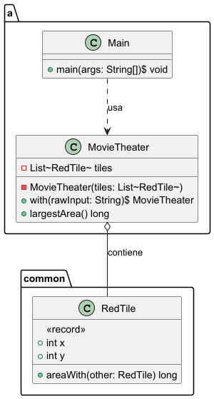
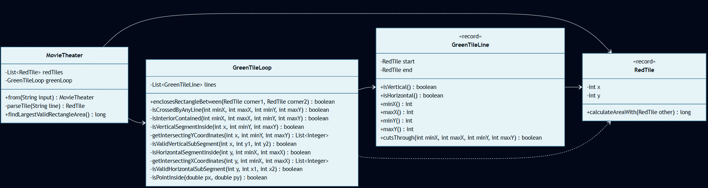

# Día 9: Movie Theater

## El Reto
### Parte A
Encontrar el rectángulo de mayor área posible dentro de la cuadrícula del cine. El rectángulo debe formarse seleccionando dos baldosas rojas cualesquiera de la lista proporcionada para que actúen como sus esquinas opuestas.

### Parte B
Una valla de baldosas verdes conecta todas las baldosas rojas formando un polígono cerrado irregular. El rectángulo elegido no solo debe tener esquinas rojas, sino que debe estar 100% contenido en el interior de este polígono. Ninguna pared verde puede atravesarlo, y ninguna parte de su área puede caer en el exterior del polígono.

---

## Diagramas
*Diagrama de clases parte 1:*

*Diagrama de clases parte 2:*

## Lógica Estructural
* **`RedTile`**: [RedTile.java](RedTile.java) - Modelo de datos inmutable (`record`). Representa un vértice del mapa y centraliza el cálculo del área geométrica.
* **`GreenTileLine`**: [GreenTileLine.java](b/GreenTileLine.java) - Entidad física (`record`). Modela un segmento (pared) del perímetro. Define la física de colisión informando si atraviesa o "raja" un área rectangular imaginaria.
* **`GreenTileLoop`**: [GreenTileLoop.java](b/GreenTileLoop.java) - El polígono completo. Evalúa el espacio cerrado. Coordina las líneas y responde a una única pregunta: si un área rectangular está estrictamente contenida en su interior.
* **`MovieTheater`**: (Parte A: [MovieTheater.java](a/MovieTheater.java) / Parte B: [MovieTheater.java](b/MovieTheater.java)) - Gestor del sistema, mantiene el estado inmutable de las baldosas y aplica los motores de búsqueda iterativa.

## Algoritmos
* **Trazado de Rayos (Ray Casting):** Algoritmo implementado para resolver el clásico problema del "Punto en Polígono" (PIP). Dispara un rayo láser virtual hacia el infinito (eje X) y cuenta las intersecciones con paredes verticales. Si cruza un número impar, certifica matemáticamente que el punto está dentro; si es par, está fuera. (Ver [GreenTileLoop.java](b/GreenTileLoop.java)).

---

### Fundamentos
* **Abstracción** *(Simplificación de detalles complejos mediante interfaces o contratos claros)*: La clase [GreenTileLoop](b/GreenTileLoop.java) expone el método lógico `enclosesRectangleBetween`, abstrayendo a los clientes de las complejas integraciones espaciales del algoritmo PIP (Point-In-Polygon).
* **Modularidad** *(División del programa en módulos bien definidos e independientes)*: Segregación precisa entre las baldosas (`RedTile`), los límites segmentados (`GreenTileLine`), el contenedor del polígono (`GreenTileLoop`) y el buscador agregador (`MovieTheater`).
* **Alta Cohesión y Bajo Acoplamiento** *(Los módulos hacen una sola cosa y dependen mínimamente entre sí)*: Existe alta cohesión porque `GreenTileLoop` gestiona la geometría del polígono cerrado y `MovieTheater` dirige la búsqueda exhaustiva del área. El acoplamiento es bajo porque las figuras geométricas operan de forma matemática pura sin saber que son asientos de cine o restricciones del negocio.
* **Código Expresivo (Clean Code)** *(Código autodocumentado que se lee como lenguaje natural)*: Uso de tipos y estructuras que explican visualmente su rol físico sin requerir comentarios, como `GreenTileLine`, `RedTile` o el método auxiliar `isCrossedByAnyLine`.

## Principios de Diseño
* **Composition Over Inheritance (COI)** *(Preferir componer clases con otras en lugar de heredarlas)*: La clase [GreenTileLine](b/GreenTileLine.java) se compone de dos instancias de `RedTile` (`start` y `end`) en lugar de heredar de un vector espacial, logrando mayor flexibilidad y reutilización directa del modelo inmutable de vértices.
* **SOLID**
    * **Single Responsibility Principle (SRP)** *(Una clase debe tener un único motivo para cambiar)*: `RedTile` calcula áreas de forma local, `GreenTileLine` analiza cortes lineales, `GreenTileLoop` valida el interior de la valla y `MovieTheater` coordina la búsqueda del área máxima.
* **Keep It Simple, Stupid (KISS)** *(Mantener el diseño lo más simple y directo posible)*: El trazado de rayos PIP se simplifica evaluando la coordenada media de los subsegmentos contra las líneas verticales del contorno, evitando complejas integraciones de áreas continuas. (Ver [GreenTileLoop.java](b/GreenTileLoop.java)).

## Técnicas
* **Inmutabilidad del Modelo** *(Uso de estados que no cambian una vez creados)*: `RedTile` y `GreenTileLine` se definen como `record` de Java, asegurando que las coordenadas no varíen por accidente durante las múltiples iteraciones espaciales.
* **Métodos Delegados** *(Dividir tareas complejas y delegar sub-operaciones)*: `enclosesRectangleBetween` ([GreenTileLoop.java](b/GreenTileLoop.java)) delega la validación secuencial en los métodos `isCrossedByAnyLine` e `isInteriorContained`.
* **Fluent API** *(Encadenamiento de métodos para crear un flujo de lectura fluido)*: En [Main.java (A)](a/Main.java) se diseña la interacción para ser encadenada y legible (`MovieTheater.from(lines).findLargestRectangleArea()`), leyéndose orgánicamente como: *"Instancia el cine desde las líneas de texto y busca el área del rectángulo más grande"*.
* **Good Naming** *(Nombres descriptivos y precisos)*: Nombres matemáticos precisos como `enclosesRectangleBetween` y `findLargestRectangleArea`.

## Patrones de Diseño
* **Factory Method (Creacional)** *(Encapsulación de la creación de objetos en métodos estáticos dedicados)*: El método `MovieTheater.from(...)` ([MovieTheater.java (A)](a/MovieTheater.java)) encapsula de forma segura la lectura e instanciación del cine.

## Paradigmas
* **Orientación a Objetos** *(Organización del software en objetos que encapsulan estado y comportamiento)*: Destaca el uso de un fuerte **Encapsulamiento**, aislando la complejidad trigonométrica y de colisión dentro de entidades puras de dominio como `RedTile` y `GreenTileLine`.
* **Programación Funcional** *(Estilo declarativo basado en funciones puras y datos inmutables)*: Destaca el uso de: la **Inmutabilidad** (mediante el uso de `records` para representar la geometría estática) y el **Estilo Declarativo** utilizando Streams para aplanar productos cartesianos y evaluar áreas sin mutar variables temporales.

---

## Verificación y Tests
Las soluciones se validan de forma automática mediante pruebas unitarias escritas con JUnit 5 y AssertJ, estructuradas semánticamente siguiendo el patrón Given-When-Then (Dado un contexto, Cuando ocurre una acción, Entonces se espera un resultado). Esta estructura, heredada del enfoque BDD (Behavior-Driven Development), orienta los tests a comprobar el comportamiento del sistema maximizando su legibilidad.

* **Parte A:** [aTest.java](../../../../../../test/java/test/day09/aTest.java) - Valida que se encuentre el área rectangular máxima entre cualquier par de esquinas rojas del plano (resultado esperado = `12`).
* **Parte B:** [bTest.java](../../../../../../test/java/test/day09/bTest.java) - Valida la lógica de contención dentro del polígono verde e identifica el mayor área rectangular válida interior (resultado esperado = `6`).

