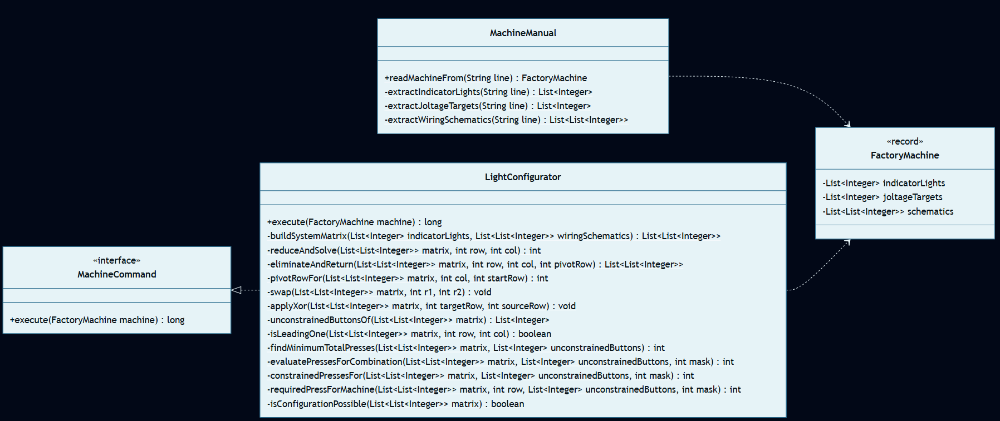
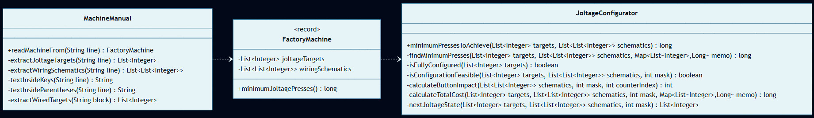

# Día 10: Factory

## El Reto
### Parte A
Restaurar las máquinas de una fábrica encendiendo/apagando luces indicadoras mediante botones interconectados. Al estar en un sistema de interruptores, las matemáticas operan en Álgebra de Boole (Módulo 2, donde 1 + 1 = 0). El objetivo es calcular el número mínimo de pulsaciones para alcanzar el patrón de luces objetivo.

### Parte B
Las reglas físicas de las máquinas cambian: los botones ya no alternan luces, sino que suman +1 a contadores de voltaje. El objetivo es encontrar la combinación exacta de pulsaciones que alcance el voltaje objetivo con el mínimo esfuerzo, teniendo en cuenta que el sistema divide la carga por la mitad en cada ciclo.

---

## Diagramas
*Diagrama de clases parte 1:*

*Diagrama de clases parte 2:*

## Lógica Estructural
* **`FactoryMachine`**: [`FactoryMachine`](FactoryMachine.java) - Modelo inmutable (`record`). Representa físicamente la máquina con sus luces y esquemas de cableado unificados para ambas partes.
* **`MachineManual`**: [`MachineManual`](MachineManual.java) - Descompone la sintaxis del texto en bruto y lo transforma en entidades `FactoryMachine` puras.
* **`MachineCommand`**: [`MachineCommand`](MachineCommand.java) - Interfaz de comportamiento (Patrón Command) que estandariza la firma de cálculo para los motores matemáticos.
* **`LightConfigurator`**: [`LightConfigurator`](a/LightConfigurator.java) - Calculadora de interruptores (Parte A). Implementa `MachineCommand` para descifrar la secuencia exacta de botones.
* **`JoltageConfigurator`**: [`JoltageConfigurator`](b/JoltageConfigurator.java) - Buscador de rutas (Parte B). Implementa `MachineCommand` para explorar las combinaciones de voltaje óptimo.

## Algoritmos
* **Eliminación de Gauss-Jordan:** Para la Parte A, la matriz de botones y luces se reduce a su forma escalonada. Al operar en binario puro (campo de Galois de 2 elementos, GF(2)), las sumas y restas tradicionales se sustituyen por operaciones lógicas XOR (`^`), despejando el sistema para encontrar qué botones son obligatorios. (Ver [`LightConfigurator`](a/LightConfigurator.java)).
* **Búsqueda en Profundidad (DFS) con Memoización:** Para la Parte B, el algoritmo explora las decisiones de pulsación dividiendo los voltajes. Se utiliza un `Map` como caché para recordar el coste mínimo de configuraciones pasadas, podando ramas imposibles o redundantes. (Ver [`JoltageConfigurator`](b/JoltageConfigurator.java)).

---
## Fundamentos
* **Abstracción** *(Simplificación de detalles complejos mediante interfaces o contratos claros)*: La interfaz [`MachineCommand`](MachineCommand.java) expone un único punto de entrada público sencillo (`execute`), abstrayendo por completo a los clientes de las complejas reducciones matriciales o búsquedas en árboles que implementan internamente los configuradores.
* **Modularidad** *(División del programa en módulos bien definidos e independientes)*: Claro aislamiento entre el almacenamiento del plano físico de la máquina (`FactoryMachine`), el parser del manual (`MachineManual`) y los motores de cálculo (`LightConfigurator`, `JoltageConfigurator`).
* **Alta Cohesión y Bajo Acoplamiento** *(Los módulos hacen una sola cosa y dependen mínimamente entre sí)*: Existe alta cohesión porque `LightConfigurator` y `JoltageConfigurator` se dedican única y exclusivamente al cálculo matemático. El acoplamiento es bajo porque estas clases matemáticas están aisladas del sistema externo: no interactúan con archivos, ni leen consolas, ni guardan estado global.
* **Código Expresivo (Clean Code)** *(Código autodocumentado que se lee como lenguaje natural)*: Uso de estructuras semánticas que explican el dominio sin requerir comentarios, como las clases `FactoryMachine` y `LightConfigurator` o el método `applyXor`.

## Principios de Diseño
* **Don't Repeat Yourself (DRY)** *(No te repitas)*: En lugar de tener las clases de dominio duplicadas, se unificaron `FactoryMachine` y `MachineManual` en la raíz `day10/` para reutilizar el modelo de datos y la lógica de parseo en ambas partes del desafío.
* **SOLID**
    * **Single Responsibility Principle (SRP)** *(Una clase debe tener un único motivo para cambiar)*: `FactoryMachine` se restringe al almacenamiento inmutable del dominio, `MachineManual` al parseo textual, y los comandos configuradores a la lógica aritmética del motor.
    * **Open/Closed Principle (OCP)** *(Abierto a la extensión, cerrado a la modificación)*: Ante la evolución física del motor, se añadió la clase `JoltageConfigurator` implementando de forma limpia la interfaz `MachineCommand` sin alterar el modelo inmutable unificado.
    * **Interface Segregation Principle (ISP)** *(No forzar a depender de interfaces que no se usan)*: La interfaz `MachineCommand` es extremadamente específica y cuenta con un único método (`execute`), garantizando que los configuradores no tengan que implementar métodos "basura" o innecesarios.
    * **Dependency Inversion Principle (DIP)** *(Depender de abstracciones, no de clases concretas)*: El cliente principal ya no depende de las clases calculadoras concretas mediante llamadas estáticas, sino que invoca sus algoritmos a través de la abstracción `MachineCommand`.
* **Keep It Simple, Stupid (KISS) & YAGNI** *(Simplicidad y no añadir código innecesario)*: Para simplificar el intercambio de filas matriciales se emplea un swap con asignaciones directas cruzadas en Java sin requerir variables temporales complejas. (Ver [`LightConfigurator`](a/LightConfigurator.java)).

## Técnicas
* **Inmutabilidad del Modelo** *(Uso de estados que no cambian una vez creados)*: `FactoryMachine` es un `record` unificado de Java, impidiendo desconfigurar los datos originales durante la simulación.
* **Inyección de Dependencias** *(Pasar colaboradores/datos en los parámetros de los métodos/constructores)*: Para aislar los motores matemáticos del modelo inmutable, el cliente `Main` inyecta la instancia `FactoryMachine` dentro de la llamada `.execute()` del comando. Adicionalmente, el mapa `memo` se inyecta directamente al método recursivo en la Parte B.
* **Métodos Delegados** *(Dividir tareas complejas y delegar sub-operaciones)*: El cálculo de pulsaciones del configurador delega en subfunciones aisladas como `pivotRowFor`, `applyXor` e `isLeadingOne`.
* **Fluent API** *(Encadenamiento de métodos para crear un flujo de lectura fluido)*: En [`Main`](a/Main.java) se simplifica el punto de entrada mediante el encadenamiento de flujos (`Files.lines(...).map(MachineManual::readMachineFrom).mapToLong(command::execute).sum()`), que se lee textualmente como: *"Toma las líneas, transfórmalas en máquinas, dáselas al comando para que las ejecute, y suma el total"*.
* **Good Naming** *(Nombres descriptivos y precisos)*: Nombres matemáticos correctos y alineados como `minimumPresses` e `isConfigurationFeasible`.

* **Inversión del Control (IoC)** *(Delegar el control del flujo a un motor o framework externo)*: El motor de Streams de Java asume el control absoluto de la iteración de datos, eliminando la necesidad de bucles iterativos manuales.
## Patrones de Diseño
* **Factory Method (Creacional)** *(Encapsulación de la creación de objetos en métodos estáticos dedicados)*: El parseador `MachineManual` proporciona la factoría estática `readMachineFrom` para aislar el tratamiento de corchetes e inicializar la máquina unificada.
* **Command (Comportacional)** *(Encapsular una petición como un objeto)*: La interfaz `MachineCommand` encapsula las invocaciones matemáticas de las partes A y B, estandarizando la ejecución algorítmica sin acoplarse al cliente de lectura `Main.java`.

* **Closure (Funcional)** *(Expresiones que capturan el estado léxico de su entorno)*: Las lambdas del motor de Streams capturan limpiamente variables locales de su contexto envolvente para operarlas sin requerir mutación global.
## Paradigmas
* **Orientación a Objetos** *(Organización del software en objetos que encapsulan estado y comportamiento)*: Destaca el uso de **Polimorfismo** mediante la interfaz `MachineCommand`, aislando las especificaciones de la máquina en el dominio `FactoryMachine` unificado y ocultando las complejas resoluciones matriciales dentro de sus respectivos comandos configuradores.
* **Programación Funcional** *(Estilo declarativo basado en funciones puras y datos inmutables)*: Destaca el uso de la **Inmutabilidad** de las configuraciones y el **Estilo Declarativo** (uso de Streams y **Funciones de 1ª Clase** como lambdas puras).

---

## Verificación y Tests
Las soluciones se validan de forma automática mediante pruebas unitarias escritas con JUnit 5 y AssertJ, estructuradas semánticamente siguiendo el patrón Given-When-Then (Dado un contexto, Cuando ocurre una acción, Entonces se espera un resultado). Esta estructura, heredada del enfoque BDD (Behavior-Driven Development), orienta los tests a comprobar el comportamiento del sistema maximizando su legibilidad.

* **Parte A:** [`aTest`](../../../../../../test/java/test/day10/aTest.java) - Verifica la correcta resolución del sistema de interruptores booleano en GF(2) para las luces indicadoras (resultado esperado = `4`).
* **Parte B:** [`bTest`](../../../../../../test/java/test/day10/bTest.java) - Verifica la búsqueda en árbol del voltaje óptimo con incremento exponencial del coste de pulsaciones duplicadas (resultado esperado = `12`).

