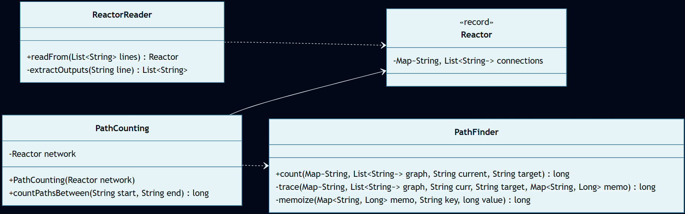
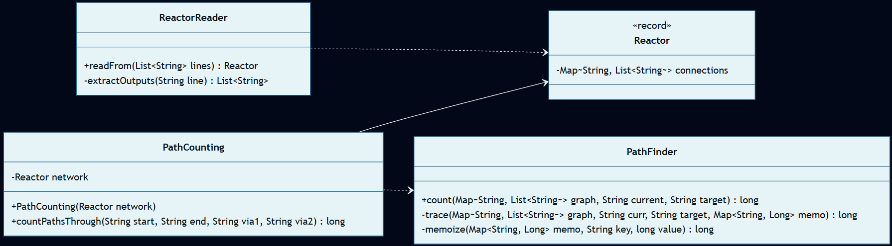

# Día 11: Reactor

## El Reto

### Parte A
Dado un listado de dispositivos y las direcciones estáticas de sus cables (flujo unidireccional), el objetivo es calcular el número total de caminos únicos posibles desde un dispositivo inicial (`you`) hasta la salida final (`out`).

### Parte B
Los datos revelan que la ruta problemática atraviesa obligatoriamente dos cuellos de botella: un conversor (`dac`) y un transformador de Fourier (`fft`). El objetivo es calcular cuántos de los caminos totales desde el servidor central (`svr`) hasta la salida (`out`) visitan ambos nodos, teniendo en cuenta que pueden ser visitados en cualquier orden.

---

## Diagramas
*Diagrama de clases parte 1:*

*Diagrama de clases parte 2:*

## Lógica Estructural
* **[`Reactor`](Reactor.java)**: Modelo de datos inmutable (`record`). Contiene el grafo de conexiones de la red.
* **[`ReactorReader`](ReactorReader.java)**: Deserializa el archivo de texto en bruto, transformando las líneas en un diccionario (`Map<String, List<String>>`). Este mapa representa una lista de adyacencia, donde la clave es un nodo de origen y el valor es la lista de nodos a los que puede viajar.
* **[`PathFinder`](PathFinder.java)**: Clase utilitaria estática que implementa el algoritmo de búsqueda recursiva en grafos utilizando caché (memoización).
* **[`PathCounting`](a/PathCounting.java) (Parte A y B)**: Clases de negocio ubicadas en sus respectivos paquetes (`a` y `b`) que utilizan el algoritmo general de búsqueda para resolver las reglas específicas de cada variante del problema.

## Algoritmos
* **Búsqueda en Profundidad (DFS):** El método `trace()` de [`PathFinder`](PathFinder.java) explora el grafo navegando nodo a nodo hasta alcanzar el caso base (llegar al destino `out` o a un callejón sin salida) y colapsando los resultados hacia arriba mediante la función de reducción `.sum()`.
* **Memoización:** Uso de caché dinámica que registra cuántos caminos válidos existen desde un nodo previamente visitado, abortando la exploración repetida de ramas y devolviendo el valor.

---

## Fundamentos
* **Abstracción** *(Simplificación de detalles complejos mediante interfaces o contratos claros)*: La clase [`PathFinder`](PathFinder.java) actúa como una abstracción que oculta toda la complejidad de la gestión de la pila recursiva y el diccionario de memoización para que el cliente solo tenga que llamar a `count()`.
* **Modularidad** *(División del programa en módulos bien definidos e independientes)*: El diseño está dividido en capas: [`Reactor`](Reactor.java) retiene los datos inmutables, [`ReactorReader`](ReactorReader.java) maneja el formato y la IO, [`PathFinder`](PathFinder.java) provee el algoritmo y [`PathCounting`](a/PathCounting.java) dirige las reglas de negocio.
* **Alta Cohesión y Bajo Acoplamiento** *(Los módulos hacen una sola cosa y dependen mínimamente entre sí)*: Existe alta cohesión porque [`PathFinder`](PathFinder.java) se focaliza exclusivamente en la matemática pura de grafos. El acoplamiento es bajo porque el algoritmo no depende de atributos de estado de la red ([`Reactor`](Reactor.java)) ni conoce el formato textual de origen.
* **Código Expresivo (Clean Code)** *(Código autodocumentado que se lee como lenguaje natural)*: Las clases actúan como actores descriptivos ([`ReactorReader`](ReactorReader.java), [`PathCounting`](a/PathCounting.java)) y exponen métodos como `countPathsBetween` o `countPathsThrough`, haciendo que las llamadas se lean de forma fluida y eviten la necesidad de añadir comentarios explicativos.

## Principios de Diseño
* **Don't Repeat Yourself (DRY)** *(No te repitas)*: La técnica de *memoización* aplicada en [`PathFinder`](PathFinder.java) es un ejemplo de DRY en ejecución, impidiendo computar dos veces los caminos por los que ya se ha transitado. Además, ambas partes (A y B) reutilizan exactamente el mismo [`ReactorReader`](ReactorReader.java) y [`PathFinder`](PathFinder.java) estático, aislando lo único que varía en su [`PathCounting`](a/PathCounting.java) particular.
* **SOLID**: 
  - **Single Responsibility Principle (SRP)** *(Una clase debe tener un único motivo para cambiar)*: Separación entre lectura de ficheros ([`ReactorReader`](ReactorReader.java)), almacenamiento estructural ([`Reactor`](Reactor.java)), cálculo matemático ([`PathFinder`](PathFinder.java)) y orquestación del requerimiento ([`PathCounting`](a/PathCounting.java)).
  - **Dependency Inversion Principle (DIP)** *(Depender de abstracciones, no de clases concretas)*: El algoritmo de búsqueda `count()` de [`PathFinder`](PathFinder.java) no opera sobre una base de datos ni sobre la clase concreta [`Reactor`](Reactor.java), sino puramente sobre las abstracciones genéricas de Java (`Map<String, List<String>>`).
* **Keep It Simple, Stupid (KISS)** *(Mantener el diseño lo más simple y directo posible)*: En lugar de crear un algoritmo matemático difícil para resolver la Parte B buscando múltiples nodos de una pasada, la clase [`PathCounting`](b/PathCounting.java) mantiene el código extremadamente simple multiplicando algebraicamente rutas directas separadas: `(A->via1 * via1->via2 * via2->B)`.
* **Law of Demeter (LoD)** *(El principio de conocimiento mínimo)*: La clase de negocio [`PathCounting`](a/PathCounting.java) solicita explícitamente a su modelo interno lo que necesita invocando `network.connections()`, en lugar de realizar llamadas encadenadas profundas.
* **You Aren't Gonna Need It (YAGNI)** *(No lo vas a necesitar)*: La solución es estricta a lo que se pide. No se han implementado algoritmos de caminos mínimos (BFS/Dijkstra) ni interfaces de enrutamiento genéricas.

## Técnicas
* **Inmutabilidad del Modelo** *(Uso de estados que no cambian una vez creados)*: Implementada gracias al uso de un tipo `record` inmutable para la entidad [`Reactor`](Reactor.java).
* **Inyección de Dependencias** *(Pasar colaboradores/datos en los parámetros de los métodos/constructores)*: Para mantener el código desacoplado, las clases [`PathCounting`](a/PathCounting.java) exigen recibir su dependencia (el modelo inmutable [`Reactor`](Reactor.java)) a través del constructor, en lugar de crearlo o leerlo directamente por sí mismas dentro de su propio código.
* **Métodos Delegados** *(Dividir tareas complejas y delegar sub-operaciones)*: En el [`PathFinder`](PathFinder.java), el método `trace()` delega el empaquetamiento del estado en caché al *helper* privado de una sola línea `memoize`.
* **Fluent API** *(Encadenamiento de métodos para crear un flujo de lectura fluido)*: En [`ReactorReader`](ReactorReader.java) se procesa el texto encadenando flujos legibles (`lines.stream().filter(l -> !l.isBlank()).collect(...)`), que se lee textualmente como: *"Toma las líneas, filtra las que no estén en blanco, y agrúpalas en un diccionario asociando cada dispositivo con sus respectivos destinos"*.
* **Inversión del Control (IoC)** *(Delegar el control del flujo a un motor o framework externo)*: En lugar de emplear bucles `for` imperativos o pilas gestionadas a mano, el iterador interno del método `stream()` y la propia pila de recursión JVM toman todo el control del flujo.
* **Good Naming** *(Nombres descriptivos y precisos)*: Nomenclatura descriptiva explícita (como `countPathsThrough` para la Parte B, indicando con la preposición el matiz exacto de su función de negocio).

## Patrones de Diseño
* **Factory Method (Creacional)** *(Encapsulación de la creación de objetos en métodos estáticos dedicados)*: El método estático `readFrom()` de [`ReactorReader`](ReactorReader.java) ejerce de factoría pura que aisla y encapsula la inicialización del objeto [`Reactor`](Reactor.java) partiendo de una simple lista de cadenas crudas.
* **Closure (Funcional)** *(Expresiones que capturan el estado léxico de su entorno)*: Durante el cómputo encadenado de iteradores en [`PathFinder`](PathFinder.java), la lambda recursiva `next -> trace(graph, next, target, memo)` actúa como un cierre funcional (closure), vinculando su contexto de ejecución original al mantener intactas las variables superiores inmutables para derivar el cálculo final.

## Paradigmas
* **Orientación a Objetos** *(Organización del software en objetos que encapsulan estado y comportamiento)*: Hay un objeto que es puramente un contenedor de datos (`Reactor`), otro objeto dedicado a leer texto (`ReactorReader`), y otro que es puramente una calculadora matemática (`PathFinder`). El programa principal simplemente conecta estas tres piezas para resolver el puzzle.
* **Programación Funcional** *(Estilo declarativo basado en funciones puras y datos inmutables)*: El núcleo algorítmico matemático ([`PathFinder`](PathFinder.java)) es la máxima expresión de estilo funcional puro: una función matemática estricta sin ningún efecto secundario en sistema global externo, sostenida de manera declarativa sobre un `record` de solo lectura.

## Tests
Las pruebas unitarias utilizan JUnit 5 y se basan en los casos de prueba provistos en la descripción del problema para validar el comportamiento algorítmico exacto exigido en el reto:
* [**`aTest.java`**](../../../../../../../test/java/test/day11/aTest.java): Verifica el conteo de la cantidad de caminos disponibles desde el dispositivo de inicio (`you`) hasta la salida final (`out`).
* [**`bTest.java`**](../../../../../../../test/java/test/day11/bTest.java): Verifica que la ruta atraviesa correctamente los dos cuellos de botella obligatorios (`dac` y `fft`) garantizando que los caminos contabilizados han visitado ambos nodos.