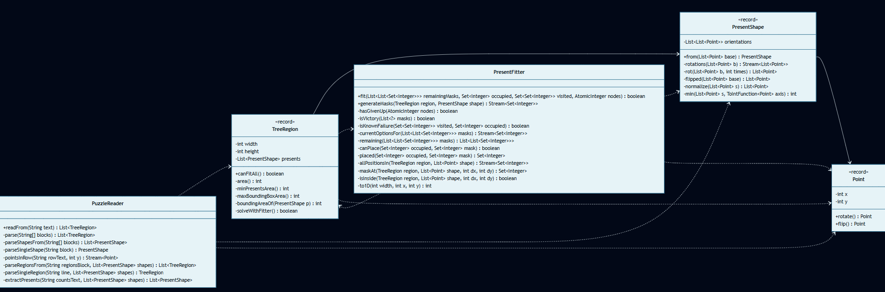

# Día 12: Granja de Árboles de Navidad

## El Reto
### Parte A
Encajar piezas irregulares (regalos) en cuadrículas bidimensionales (el espacio bajo los árboles). Las piezas se pueden rotar y voltear (efecto espejo). Dado un catálogo de formas y una lista de pedidos para cada árbol, el objetivo es calcular en cuántas regiones es físicamente posible empaquetar todos los regalos asignados sin que se superpongan ni se salgan de los límites.

---

## Diagramas
*Diagrama de clases parte 1:*

## Lógica Estructural
* **[`PuzzleReader`](PuzzleReader.java)**: Descompone el archivo en crudo para extraer las plantillas de los regalos y los requisitos de área, transformando cadenas de texto en objetos inmutables.
* **[`Point`](Point.java)**: Encapsula las reglas del universo 2D: sabe cómo rotar 90º (`-y, x`) y cómo voltearse en modo espejo (`-x, y`).
* **[`PresentShape`](PresentShape.java)**: Representa un regalo. Genera y normaliza (anclando al 0,0) sus 8 posibles variaciones espaciales en el momento de su instanciación.
* **[`TreeRegion`](TreeRegion.java)**: Es un *record* de datos puro que encapsula las dimensiones de la granja.
* **[`PresentsFit`](PresentsFit.java)**: Interfaz abstracta de Fluent API que responde a la pregunta de negocio *"¿Encajan los regalos bajo la región...?"* mediante el contrato `fitUnderRegion()`.
* **[`PresentsFitLogic`](PresentsFitLogic.java)**: Implementación de `PresentsFit` que evalúa todas las permutaciones espaciales, resolviendo el puzzle mediante el cruce de máscaras de bits (`BitSet`).

## Algoritmos
* **Búsqueda Funcional con Backtracking:** El método `fit()` en [`PresentsFitLogic`](PresentsFitLogic.java) explora el árbol de decisiones de forma encadenada. Coloca una máscara y evalúa; si choca, descarta y prueba otra.
* **Memoización:** Uso de memoization que registra estados puros del tablero explorados (`visited`), cortando ramas muertas instantáneamente apoyándose en la rapidez comparativa del hash de `BitSet`.

---

## Fundamentos
* **Abstracción** *(Simplificación de detalles complejos mediante interfaces o contratos claros)*: La creación de la interfaz [`PresentsFit`](PresentsFit.java) expone un contrato limpio `fitUnderRegion()`, aislando completamente la implementación concreta del algoritmo de backtracking del modelo de dominio.
* **Modularidad** *(División del programa en módulos bien definidos e independientes)*: División funcional en componentes especializados: la matemática espacial en [`Point`](Point.java), la geometría de los regalos en [`PresentShape`](PresentShape.java) y el motor algorítmico en [`PresentsFitLogic`](PresentsFitLogic.java).
* **Alta Cohesión y Bajo Acoplamiento** *(Los módulos hacen una sola cosa y dependen mínimamente entre sí)*: Existe alta cohesión porque [`PresentShape`](PresentShape.java) solo gestiona sus propias rotaciones, sin intentar colocarse en el tablero. El acoplamiento es bajo porque el motor de evaluación (`PresentsFitLogic`) opera ignorando por completo de dónde vienen los datos o si se leyeron de un fichero.
* **Código Expresivo (Clean Code)** *(Código autodocumentado que se lee como lenguaje natural)*: En la clase [`Main`][main], la línea `regions.stream().filter(presents::fitUnderRegion).count();` se lee literalmente como *"filtra las regiones donde los regalos encajen debajo, y cuéntalas"*, sin requerir ningún comentario explicativo.

## Principios de Diseño
* **SOLID**:
    * **Single Responsibility Principle (SRP)** *(Una clase debe tener un único motivo para cambiar)*: Cada clase cumple un único rol: [`PuzzleReader`](PuzzleReader.java) solo parsea texto, [`Point`](Point.java) gestiona transformaciones 2D, [`PresentShape`](PresentShape.java) maneja permutaciones, [`TreeRegion`](TreeRegion.java) solo almacena datos, [`PresentsFitLogic`](PresentsFitLogic.java) evalúa colocaciones.
    * **Open/Closed Principle (OCP)** *(Abierto a la extensión, cerrado a la modificación)*: Gracias a [`PresentsFit`](PresentsFit.java), el programa está abierto a soportar nuevos algoritmos sin tener que modificar [`Main`][main] ni las clases base.
    * **Liskov Substitution Principle (LSP)** *(Las clases derivadas deben poder sustituir a sus clases base)*: Cualquier clase que implemente la interfaz `PresentsFit` (como nuestro `PresentsFitLogic`) puede ser utilizada por la clase [`Main`][main] sin romper el programa ni requerir cambios en el código de [`Main`][main], ya que todas respetan exactamente el mismo contrato (recibir una región y devolver un booleano).
    * **Interface Segregation Principle (ISP)** *(No forzar a depender de interfaces que no se usan)*: La interfaz `PresentsFit` es estrictamente específica y cuenta con un único método (`fitUnderRegion`), garantizando que las clases que la implementen no tengan que depender de métodos irrelevantes.
    * **Dependency Inversion Principle (DIP)** *(Depender de abstracciones, no de implementaciones)*: Las clases operan sobre la interfaz `PresentsFit`, sin depender de la compleja implementación concreta.
* **Composition Over Inheritance (COI)** *(Preferir componer sobre heredar)*: En lugar de crear una jerarquía de herencia (como tener una clase base `Shape` y subclases como `LShape` o `SquareShape`), definimos genéricamente cualquier regalo agrupando múltiples coordenadas [`Point`](Point.java) en una colección (composición).
* **Don’t Repeat Yourself (DRY)** *(Evitar la duplicación de lógica)*: Las reglas matemáticas de giro y reflexión se aíslan completamente en [`Point`](Point.java) y se reutilizan para generar todas las mutaciones sin repetir la fórmula.
* **Law of Demeter (LoD)** *(El principio de conocimiento mínimo)*: En lugar de que `PresentsFitLogic` extraiga constantemente la anchura y altura de la región para calcularla manualmente, invoca directamente el método `region.area()` sobre [`TreeRegion`](TreeRegion.java), delegando el cálculo matemático al propio objeto que posee los datos.
* **Keep It Simple, Stupid (KISS)** *(Mantener el diseño lo más simple y directo posible)*: En vez de usar cuadrículas y matrices 2D liosas para detectar choques, hemos aplanado el tablero a una simple línea de ceros y unos (`BitSet`), haciendo que calcular las colisiones sea más fácil.
* **Diseño por Contrato (DbC)** *(Definir contratos formales)*: La interfaz [`PresentsFit`](PresentsFit.java) actúa como un contrato estricto: la clase [`Main`][main] le entrega la región y confía en que le devolverá la respuesta correcta (`true` o `false`). A [`Main`][main] no le importa cómo se hacen los cálculos por dentro, solo se fía de la promesa del contrato.

## Técnicas
* **Inmutabilidad del Modelo** *(Uso de estados que no cambian una vez creados)*: [`TreeRegion`](TreeRegion.java) y [`PresentShape`](PresentShape.java) son *records* inmutables. Además, en [`PresentsFitLogic`](PresentsFitLogic.java), cada vez que probamos a colocar un regalo en el tablero (`BitSet`), hacemos un clon (una copia) del tablero original en la función `placed()`. Así evitamos que un intento fallido ensucie el tablero para los siguientes cálculos.
* **Inversión del Control (IoC)** *(El flujo de ejecución es dictado por el framework o pipeline, no por código imperativo)*: Delegación del control a los _Streams_ para propagar máscaras de forma declarativa sin la necesidad de escribir bucles.
* **Inyección de Dependencias** *(Pasar colaboradores/datos en los parámetros de los métodos/constructores)*: En lugar de que `TreeRegion` cree sus propios regalos internamente, se le inyecta la lista de `PresentShape` ya construida a través de su constructor. Además, inyectamos comportamiento al `Stream` mediante la referencia `presents::fitUnderRegion`.
* **Métodos Delegados** *(Dividir tareas complejas y delegar sub-operaciones)*: El método público `fitUnderRegion` delega el proceso de encaje en funciones privadas especializadas (`fit` y `placed`).
* **Good Naming** *(Nombres descriptivos y precisos)*: En lugar de usar nombres técnicos abstractos, usamos términos del problema real que explican claramente lo que hacen (ej: `PresentsFitLogic`, `fitUnderRegion`). Además, los métodos privados se leen como preguntas naturales (`isInside`, `allPositionsIn`, `maskAt`).
* **Fluent API** *(Encadenamiento de métodos para crear un flujo de lectura fluido)*: Nombrado de clases e interfaces que permite la lectura en lenguaje natural `.filter(presents::fitUnderRegion)`.

## Patrones de Diseño
* **Factory Method (Creacional)** *(Encapsulación de la creación de objetos en métodos estáticos dedicados)*: Se ha implementado `PresentsFit.fitLogic()` en la interfaz y `from()` en [`PresentShape`](PresentShape.java) y [`PuzzleReader`](PuzzleReader.java), ocultando por completo la construcción de los objetos.
* **Closure (Funcional)** *(Captura del entorno léxico dentro de una función)*: Uso de cierres lógicos como en `index -> maskAt(region, shape, ...)` dentro de [`PresentsFitLogic`](PresentsFitLogic.java), encapsulando la referencia al contexto.

## Paradigmas
* **Orientación a Objetos** *(Organización del software en objetos que encapsulan estado y comportamiento)*: Representación semántica y fuertemente polimórfica combinando records inmutables e interfaces de negocio descriptivas y fluidas.
* **Programación Funcional** *(Estilo declarativo basado en funciones puras y datos inmutables)*: Predominio total del paradigma, eliminando el control de flujo imperativo (ausencia de loops explícitos) y apostando por tuberías declarativas.

---

## Verificación y Tests
Las soluciones se validan de forma automática mediante pruebas unitarias escritas con JUnit 5 y AssertJ, estructuradas semánticamente siguiendo el patrón Given-When-Then (Dado un contexto, Cuando ocurre una acción, Entonces se espera un resultado). 

* [**`aTest.java`**](../../../../../../test/java/test/day12/aTest.java): Verifica la colocación óptima de regalos apoyándose sobre el contrato `PresentsFit` (resultado esperado = `433`).

[Main]: Main.java
